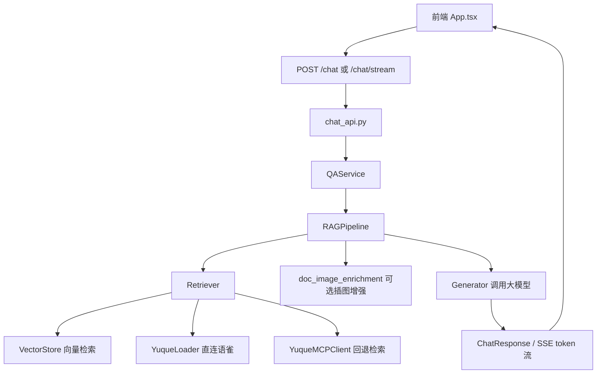
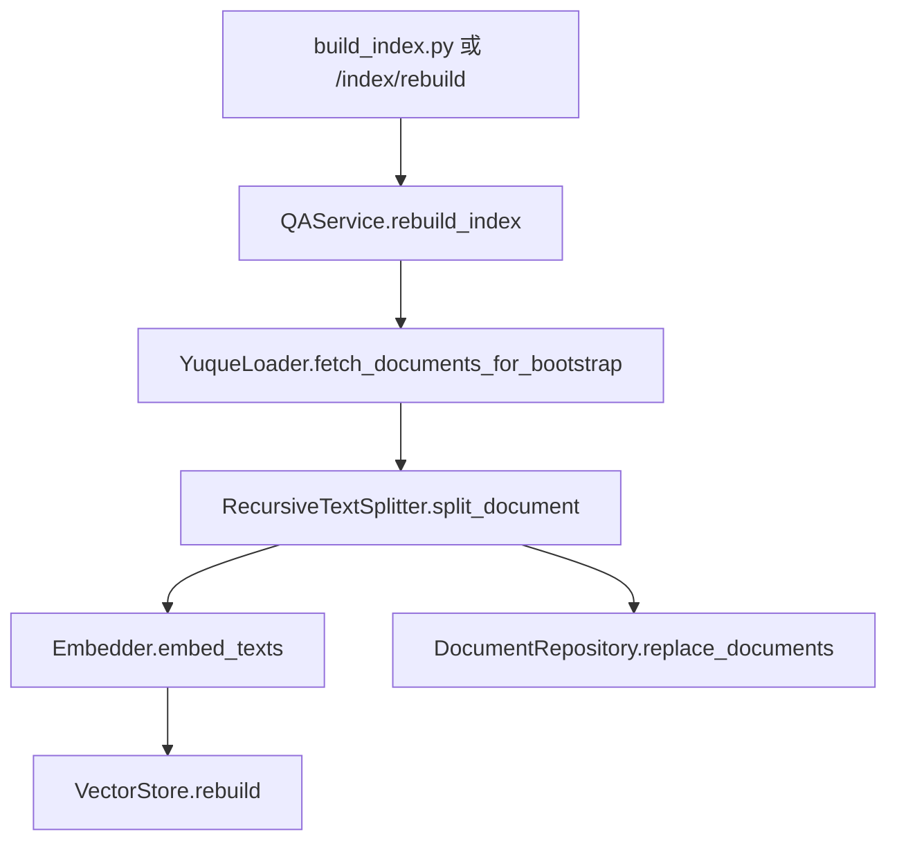

# 01. 项目总览与架构

## 1. 项目定位

该仓库实现的是一个面向企业知识库场景的 RAG 问答系统 MVP，核心数据源为语雀知识库。系统通过语雀 OpenAPI 或 MCP 工具读取文档，再结合向量检索与大模型生成，为用户提供基于知识库上下文的回答。

当前系统同时包含两条界面链路：

- 主界面：`frontend/`，基于 `React + TypeScript + Vite`
- 回退界面：`web/`，静态 legacy 页面

当前运行主链以 `app/main.py` 为后端入口，`frontend/src/main.tsx` 为前端入口。

## 2. 总体技术栈

| 层次 | 技术 |
|---|---|
| Web 后端 | FastAPI, Uvicorn |
| 前端 | React 19, TypeScript, Vite |
| 知识源接入 | Yuque OpenAPI, yuque-mcp-server |
| 检索 | OpenAI 兼容 Embedding, FAISS, NumPy |
| 生成 | DeepSeek / OpenAI 兼容 Chat Completions |
| 存储 | SQLite, 本地文件向量索引 |
| 测试 | pytest, pytest-asyncio |

## 3. 代码结构总览

```text
app/
  api/        HTTP 路由与接口协议
  core/       配置、日志、语雀 Token 相关基础设施
  data/       语雀 OpenAPI、MCP、切片、图片处理
  db/         SQLite DDL、连接工厂、仓储
  rag/        检索、生成、路由、插图增强、RAG 流程
  schemas/    Pydantic 请求/响应模型
  service/    业务编排服务
  storage/    向量存储
  main.py     FastAPI 入口

frontend/
  src/
    App.tsx   主界面与主要交互逻辑
    main.tsx  React 挂载入口
  vite.config.ts

scripts/
  build_index.py
  build_frontend.sh
  dev_up.sh
  dev_down.sh
  dev_status.sh
```

## 4. 架构分层

### 4.1 后端分层

1. 接口层：`app/api/chat_api.py`
2. 服务层：`app/service/qa_service.py`
3. RAG 编排层：`app/rag/pipeline.py`
4. 检索与生成层：`app/rag/retriever.py`、`app/rag/generator.py`
5. 数据接入层：`app/data/yuque_loader.py`、`app/data/mcp_client.py`
6. 存储层：`app/storage/vector_store.py`、`app/db/repositories.py`
7. 基础设施层：`app/core/config.py`、`app/core/logger.py`

### 4.2 前端分层

1. 页面入口：`frontend/src/main.tsx`
2. 页面容器：`frontend/src/App.tsx`
3. Markdown 与技能辅助：`markdownAutolink.ts`、`matchRoutedSkill.ts`
4. Vite 代理与构建：`frontend/vite.config.ts`

## 5. 核心运行链路

### 5.1 问答链路



### 5.2 索引构建链路



## 6. 系统模式

系统在运行期有两种主要问答模式：

- `rag`：启用 embedding，先做向量检索，召回不足时再尝试 MCP 回退
- `direct_yuque`：未配置 embedding 时，不走本地向量库，直接使用语雀 OpenAPI 或 MCP

`QAService.runtime_mode()` 会根据是否成功构建 `Embedder` 决定当前模式。

## 7. 关键入口文件

| 文件 | 角色 | 说明 |
|---|---|---|
| `app/main.py` | 后端入口 | 初始化 FastAPI、生命周期依赖与静态资源托管 |
| `app/api/chat_api.py` | API 路由 | 暴露问答、目录、索引、能力检查等接口 |
| `app/service/qa_service.py` | 业务总编排 | 构建检索器、生成器、MCP 客户端与运行模式 |
| `app/rag/pipeline.py` | RAG 主流程 | 检索、scope_help、插图增强、生成 |
| `frontend/src/main.tsx` | 前端入口 | 挂载 React 应用 |
| `frontend/src/App.tsx` | 前端主页面 | 会话、SSE、目录、技能与 UI 状态管理 |
| `scripts/build_index.py` | 索引脚本 | 拉文档、切片、向量化并重建索引 |

## 8. 旧链路与兼容内容

仓库根目录还存在一套较早的 CLI/Agent 入口：

- `main.py`
- `agent.py`
- `yuque_client.py`

这部分并不是当前 Web 应用主链路，但保留在仓库中，可能用于历史实验或命令行问答场景。维护当前产品功能时，应优先关注 `app/` 与 `frontend/` 目录。

## 9. 维护建议

- 新功能优先放入 `app/service` 与 `app/rag`，避免把业务逻辑直接写进路由层
- 新接口的输入输出统一落到 `app/schemas`
- 若新增新的检索来源，应优先扩展 `Retriever`，并保持 `RetrievalResult` 输出结构稳定
- 若新增新的前端面板或交互，优先拆出 `App.tsx` 中的局部逻辑，避免单文件继续膨胀
