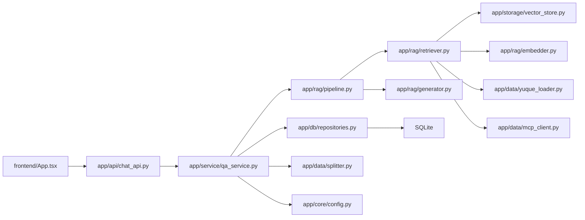
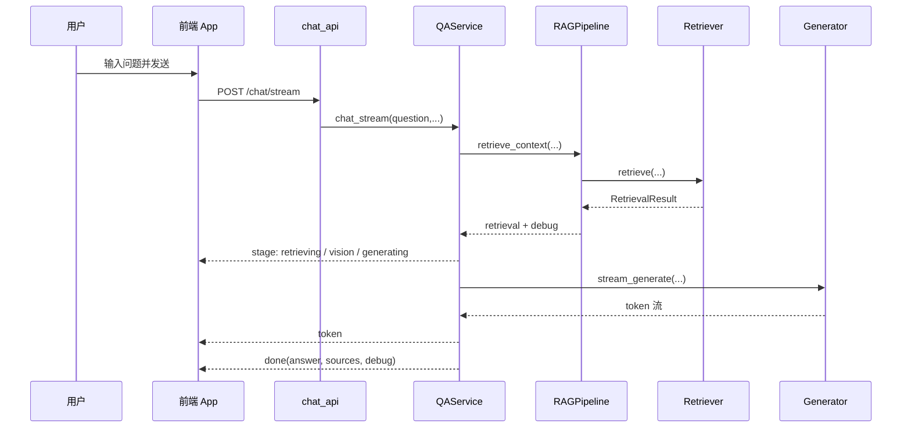
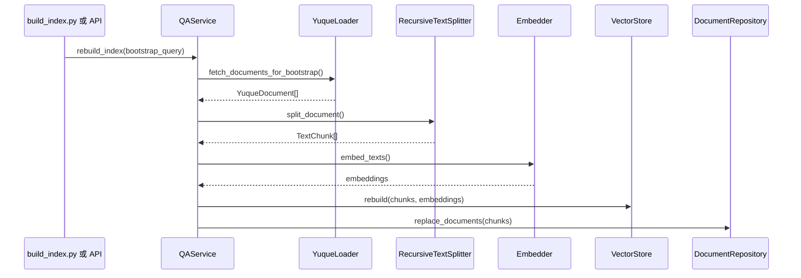

# 04. 数据流与依赖关系

## 1. 本文目标

本文件重点说明系统中各模块之间如何依赖、请求如何流转，以及哪些组件是强依赖、哪些组件是可选依赖。

## 2. 模块依赖总图



## 3. 后端依赖层次

### 3.1 应用启动依赖

`app/main.py` 启动时会构造以下对象：

1. `DatabaseSessionFactory`
2. `DocumentRepository`
3. `QALogRepository`
4. `YuqueLoader`
5. `VectorStore`
6. `QAService`

`QAService` 内部继续构造：

1. `RecursiveTextSplitter`
2. `Embedder`
3. `Generator`
4. `YuqueMCPClient`
5. `RAGPipeline`
6. `Retriever`

因此，启动时最重要的依赖链是：

```text
Settings
  -> QAService
    -> Retriever
      -> VectorStore / Embedder / YuqueLoader / YuqueMCPClient
    -> RAGPipeline
      -> Generator
```

## 4. 主要请求数据流

### 4.1 `/chat/stream` 数据流



### 4.2 索引重建数据流



## 5. 检索数据流详解

### 5.1 向量检索路径

触发条件：

- 已配置 `EMBEDDING_API_KEY`
- 当前请求 scope 与默认向量索引 scope 一致
- 当前不是副账号强制直连模式

流程：

1. `Retriever` 调用 `Embedder.embed_query()`
2. `VectorStore.search()` 返回 `RetrievedChunk`
3. 若得分高于阈值，直接作为上下文
4. 若得分不足，尝试走 MCP 回退

数据转换：

- `StoredChunk` -> `RetrievedChunk` -> `SourceItem`

### 5.2 语雀直连路径

触发条件：

- 未启用 embedding
- 或 scope 与当前本地索引不一致
- 或当前 Token 为副账号

流程：

1. `Retriever._classify_intent()` 判断是目录、文档列表还是正文问题
2. 目录问题调用 `YuqueLoader.get_book_toc()`
3. 文档列表问题调用 `YuqueLoader.list_docs()`
4. 正文问题调用 `YuqueLoader.search_docs()` 再 `get_doc()`
5. 未命中时再尝试标题匹配和 MCP 回退

### 5.3 MCP 回退路径

触发条件：

- 向量命中弱
- 语雀 OpenAPI 命中失败
- 显式配置 `FORCE_MCP_FALLBACK`
- 某些目录/清单类问题更适合走 MCP

回退工具链：

- `yuque_search`
- `yuque_get_doc`
- `yuque_list_docs`
- `yuque_get_toc`
- 自动路由模式下的其它只读工具

## 6. 文档锚定数据流

这是当前系统非常关键的一条增强链路。

### 6.1 前端侧

1. 用户在输入框使用 `@` 触发联想
2. 前端请求 `/docs/suggest`
3. 用户选中某篇文档后，文档进入 `selectedYuqueDocs`
4. 提问时，这些文档进入请求字段 `selected_yuque_docs`

### 6.2 后端侧

1. `ChatRequest.selected_yuque_docs` 被解析为 `SelectedYuqueDocRef`
2. `QAService._doc_anchor_pairs()` 转为 `(doc_id, slug)` 列表
3. `Retriever.retrieve()` 优先处理这些 anchors
4. 如果向量命中中已有相同 `doc_id`，优先保留锚定结果
5. 若向量库没有对应命中，则直接调用语雀正文拉取作为回退

### 6.3 价值

- 提升“指定某篇文档回答”的可控性
- 降低向量检索时标题不同、召回偏移造成的误答
- 让前端知识库面板与问答主链真正打通

## 7. 图片与多模态数据流

系统支持两种与图片相关的增强方式。

### 7.1 Markdown 图片代理

流程：

1. 检索结果命中文档片段
2. `doc_image_enrichment` 提取图像引用
3. 将原始语雀图片链接转换为 `/yuque/asset?t=...`
4. 生成器按要求把这些图片 Markdown 原样插入答案

### 7.2 多模态识图

触发条件：

- `VISION_ENABLED=true`
- 已配置 `VISION_API_KEY`

流程：

1. 插图增强阶段拉取图片
2. 通过 OpenAI 兼容视觉模型做图片识读
3. 把识读摘要补入上下文
4. 文本大模型据此生成最终回答

## 8. 配置依赖关系

### 8.1 强依赖配置

| 配置 | 作用 |
|---|---|
| `YUQUE_TOKEN` | 访问语雀 OpenAPI 的基础凭证 |
| `YUQUE_SCOPE` | 默认知识库作用域 |
| `DEEPSEEK_API_KEY` 或 `LLM_API_KEY` | 生成答案所需 |

没有生成模型 API key 时，系统虽然能启动，但无法完成最终回答。

### 8.2 可选依赖配置

| 配置 | 作用 |
|---|---|
| `EMBEDDING_API_KEY` | 启用向量索引与向量检索 |
| `YUQUE_MCP_COMMAND` | 启用 MCP 回退 |
| `YUQUE_TOKEN_SECONDARY` | 启用副账号访问 |
| `VISION_ENABLED` 及相关配置 | 启用图片识读 |
| `INTENT_LLM_ENABLED` | 启用 LLM 检索意图分类 |
| `AUTO_MCP_TOOL_ROUTER` | 启用 LLM 自动选择 MCP 工具 |

## 9. 运行时产物依赖

### 9.1 文件系统

`data_runtime/` 下的关键运行时文件：

- `rag_mvp.db`：SQLite 数据库
- `vector_store/index.faiss`：FAISS 索引
- `vector_store/index.npy`：无 FAISS 时的 NumPy 索引
- `vector_store/chunks.json`：切片元数据

### 9.2 前端静态资源

后端启动后会根据以下优先级决定界面来源：

1. 若 `frontend/dist` 存在，则托管 React 构建产物
2. 否则回退到 `web/` 目录中的 legacy 页面

## 10. 第三方依赖关系

### 10.1 Python 依赖

| 依赖 | 角色 |
|---|---|
| `fastapi` | Web API 框架 |
| `uvicorn` | ASGI 服务 |
| `httpx` | 调用语雀和其它 HTTP 服务 |
| `python-dotenv` | 加载 `.env` |
| `pydantic` | 请求响应校验 |
| `faiss-cpu` | 向量索引 |
| `numpy` | 向量与矩阵计算 |
| `openai` | OpenAI 兼容接口客户端 |
| `aiosqlite` | 异步 SQLite 访问 |

### 10.2 前端依赖

| 依赖 | 角色 |
|---|---|
| `react` / `react-dom` | 页面框架 |
| `react-markdown` | Markdown 渲染 |
| `remark-gfm` | GFM Markdown 支持 |
| `vite` | 前端开发与构建 |

## 11. 关键耦合点

以下耦合点需要特别注意：

### 11.1 Skill 关键词耦合

- 前端：`matchRoutedSkill.ts`
- 后端：`app/rag/skill_router.py`

两边必须保持一致，否则会出现前端提示与后端实际路由不一致的问题。

### 11.2 SSE 协议耦合

后端发出的事件：

- `stage`
- `token`
- `done`
- `error`

前端 `askQuestion()` 会直接按这四种事件分支处理，因此协议变更必须同步。

### 11.3 文档模型耦合

- 前端 `DocMeta`
- 后端 `DocMeta` schema
- 后端 `SelectedYuqueDocRef`
- 检索层 `doc_anchors`

这是一条跨越前端、API、服务层和检索层的完整链路，字段改名或语义变更时必须整体联动。

## 12. 调试建议

### 12.1 观察点

- 前端界面中的阶段提示、来源列表与 debug 文本
- 后端日志中的 `retrieval_mode`、`mcp_route`、向量命中数
- `data_runtime/vector_store/chunks.json` 中的切片内容
- `qa_logs` 中记录的历史问答

### 12.2 常见判断方法

- 回答没引用知识库内容：先看 `debug.retrieval_mode`
- 文档列表问题回答异常：检查是否被误分到 `content`
- 指定文档没有生效：检查 `selected_yuque_docs` 是否成功传到后端
- 回答提到图片但不展示：检查 `/yuque/asset` 代理与文档插图增强配置
