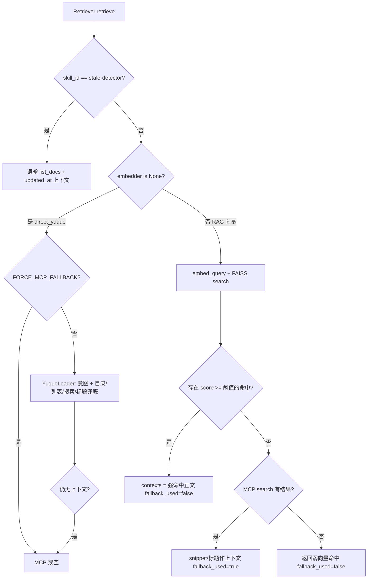

# 产品使用文档（业务使用 + 技术说明）

> **读者**：Part A 面向业务同事与最终使用者；Part B 面向需要读懂问答链路的开发者。  
> **关联**：[README.md](../README.md)、[AGENTS.md](../AGENTS.md)、[前后端启动说明.md](前后端启动说明.md)、[.env.example](../.env.example)。  
> **安全**：本文不列举真实密钥；请始终在本地 `.env` 中配置敏感信息，且勿将 `.env` 提交到 git。

---

## Part A · 产品使用

### 1. 环境配置（`.env`）

在仓库根目录复制模板并编辑：

```bash
cp .env.example .env
```

按 [.env.example](../.env.example) 填写，**至少需要**：

| 类别 | 变量要点 |
|------|----------|
| 语雀 | `YUQUE_TOKEN`、`YUQUE_SCOPE`（知识库作用域，如 `组织/知识库`）、可选 `YUQUE_BASE_URL` |
| 向量/RAG | `EMBEDDING_*`：`EMBEDDING_API_KEY` 未配置时，系统进入「语雀直连」运行时模式（见下文）；`EMBEDDING_PROVIDER` / `EMBEDDING_MODEL` / `EMBEDDING_BASE_URL` 与所选嵌入服务一致 |
| 生成（LLM） | `LLM_PROVIDER`、`LLM_MODEL`、`DEEPSEEK_API_KEY` 或 `LLM_API_KEY`、`LLM_BASE_URL`；默认可与 DeepSeek 兼容端点对齐 |
| 检索参数 | `TOP_K`、`CHUNK_SIZE`、`CHUNK_OVERLAP`、`RETRIEVAL_SCORE_THRESHOLD` 影响切片与向量命中强弱 |
| MCP 降级（可选） | `YUQUE_MCP_COMMAND`、`YUQUE_MCP_ARGS`、`YUQUE_MCP_SEARCH_TOOL`、`YUQUE_MCP_GET_DOC_TOOL`；`FORCE_MCP_FALLBACK`、`AUTO_MCP_TOOL_ROUTER`；意图分类 `INTENT_LLM_ENABLED`、`INTENT_LLM_MODEL` |

说明：若进程环境里已导出某变量，**不会**被 `.env` 覆盖（与 `python-dotenv` 默认行为一致）。

### 2. 建索引（向量模式）

**前提**：已配置嵌入服务的 `EMBEDDING_API_KEY`（否则 `rebuild_index` 会直接返回 0 篇文档、0 个块，向量检索不可用）。

常用方式：

- **命令行**（可指定引导查询，决定首次从语雀拉取哪些文档参与建库）：

  ```bash
  source scripts/activate.sh
  BOOTSTRAP_QUERY=你的引导关键词 python scripts/build_index.py
  ```

- **HTTP**（服务已启动时）：`POST /index/rebuild` 或 `POST /sync/yuque`（具体语义见 [README.md](../README.md) 中 API 说明）。

索引与元数据默认落在 `data_runtime/` 等路径（以 `Settings` 为准，详见 README）。

### 3. 启动服务

**一键联调、端口、常见问题**请直接阅读 [前后端启动说明.md](前后端启动说明.md)。

速记：根目录 `make dev` 或分别启动后端 `make run` 与前端 `cd frontend && npm run dev`；浏览器访问 **`http://127.0.0.1:8000/`** 或按启动说明中的 Vite 地址使用。

### 4. 在页面提问

1. 打开前端聊天页（开发态一般由 Vite 提供；生产构建可由 FastAPI 托管静态资源）。  
2. 在输入框输入问题并发送；若界面支持流式输出，将走 `POST /chat/stream` 的 SSE。  
3. 回答区域展示模型回复；若启用了来源展示，可看到引用列表（与后端 `sources` 对应）。

### 5. 运行时两种模式（`GET /runtime-mode`）

后端根据**是否成功构造嵌入器**划分模式（见 `QAService.runtime_mode`）：

| 模式值 | 展示标签 | 含义 |
|--------|----------|------|
| `rag` | RAG 向量模式 | 已配置 `EMBEDDING_API_KEY`，检索优先用 **query 嵌入 + FAISS**；弱命中时可按配置走 MCP 等降级 |
| `direct_yuque` | 语雀直连模式 | **未**配置嵌入密钥，不走向量检索；通过语雀 HTTP API（及规则/可选 MCP）拉取正文或目录类上下文 |

补充：当前端请求带 `owner` 且与默认 `YUQUE_SCOPE` 不一致时，服务端会为该次请求**临时关闭向量检索**（强制语雀直连链路），避免向量索引作用域与语雀作用域不一致。

### 6. 常见问题

| 现象 | 可能原因 | 建议 |
|------|----------|------|
| 一直提示缺少 LLM Key | `DEEPSEEK_API_KEY` / `LLM_API_KEY` 未配置 | 检查 `.env` 与进程环境 |
| 永远是 `direct_yuque` | 未配置 `EMBEDDING_API_KEY` | 配置嵌入服务后重启并重建索引 |
| 向量答非所问或很空 | 索引过期、阈值过高、`TOP_K` 过小 | 重建索引、调 `RETRIEVAL_SCORE_THRESHOLD` / `TOP_K` |
| 语雀报错 503 | Token、作用域、网络或语雀限流 | 查看日志 detail，`self_check.py` 独立自检语雀 |
| 想强制走 MCP | `FORCE_MCP_FALLBACK=true`（直连模式下跳过语雀 HTTP 检索主路径） | 需正确配置 MCP 命令与工具名 |

---

## Part B · 技术说明（端到端链路）

### 1. 总览：从提示词到响应

1. **前端** `fetch` → `POST /chat` 或 `POST /chat/stream`（`app/api/chat_api.py`）。  
2. **路由**调用 `QAService.chat` / `chat_stream`（`app/service/qa_service.py`）。  
3. **Skill 路由**：`route_skill(question)`（`app/rag/skill_router.py`）可选匹配关键词，得到 `skill_id` 与 `generation_instruction`。  
4. **Pipeline**：`RAGPipeline.run` / `run_stream`（`app/rag/pipeline.py`）先 `Retriever.retrieve`，再 `Generator.generate` / `stream_generate`。  
5. **Retriever**（`app/rag/retriever.py`）按模式返回 `contexts`、`sources`、`fallback_used`、`debug`。  
6. **Generator**（如 `DeepSeekGenerator`，`app/rag/generator.py`）把上下文与来源拼装进对话，调用 OpenAI 兼容接口生成 Markdown。  
7. **非流式**：直接返回 `ChatResponse`；**流式**：SSE 多次 `event: token`，最后 `event: done` 带上完整 JSON；异常为 `event: error`。

### 2. `retrieval_question` 与 `generation_question`

与 [开发计划.md](开发计划.md) 中的约定一致，代码里表现为：

- **`retrieval_question`**：始终传入**用户原始问题**（当前实现里与 `question` 相同），供 `Retriever` 做意图分类、语雀搜索、向量 query 嵌入等。这样 Skill 注入的长指令**不会污染**检索语义。  
- **`generation_question`**：无 Skill 时等于用户问题；有 Skill 时包装为 `[skill_id=...]\n{generation_instruction}\n\n用户问题：{question}`，仅传给 **Generator**，用于控制输出结构与任务说明。

`stale-detector` Skill 在检索侧走专门分支：拉取文档列表并把 `updated_at` 注入上下文，而非通用向量检索。

### 3. 检索分支（嵌入 / 语雀 / MCP）—与源码一致

下面按 `Retriever.retrieve` 的逻辑归纳（省略极细节，以代码为准）。



**语雀 HTTP**（`YuqueLoader`）：直连模式下用于 `search_docs`、`get_doc`、`list_docs`、`get_book_toc` 等；失败或无可读上下文时会进入 **MCP** 路径（`_retrieve_from_mcp_or_empty`），按意图尝试 TOC、文档列表、`search`+`get_doc` 等（见 `app/rag/retriever.py`）。

**向量 + FAISS**：RAG 模式下对 `retrieval_question` 做 `embed_query`，`VectorStore.search` 取 `top_k`；强命中（分数 ≥ `RETRIEVAL_SCORE_THRESHOLD`）直接作为上下文。否则若 MCP 搜索有结果，则用 MCP 摘要作上下文并标记 **`fallback_used=True`**；若 MCP 也无结果，则把**弱向量命中**返回给生成器，`fallback_used=False`。

### 4. 生成与来源

- **Generator**（`DeepSeekGenerator._build_prompt`）将 `contexts` 编号拼接，将 `sources` 列为「参考来源」，并要求模型严格基于上下文、输出固定 Markdown 结构（含「## 回答」「## 参考来源」）。  
- **`sources`**：每项含 `title`、`url`（可按 `expose_source_urls` 在返回前置空）、`source_type`（`vector` / `yuque` / `mcp`）、可选 `score`、`snippet`。  
- **`fallback_used`**：布尔值，表示本次检索是否处于「主路径之外的降级」语义（例如向量弱命中后改用 MCP /snippets）；具体组合见 `Retriever` 各返回分支。  
- **`debug`**：`RAGPipeline` 在 `retrieval.debug` 为空时会填充 `retrieval_mode`、`fallback_used`、`source_types`、`source_count` 等；MCP 路径下往往带有更细的 MCP 路由信息。

### 5. 流式 SSE（`/chat/stream`）

`chat_api.chat_stream` 使用 `StreamingResponse`，媒体类型 `text/event-stream`。每条事件格式为：

- `event: token` —— `data` 为 JSON，`{"token": "..."}`，对应模型增量文本。  
- `event: done` —— `data` 为完整 `ChatResponse.model_dump()`（含 `answer`、`sources`、`fallback_used`、`debug`）。  
- `event: error` —— `data` 为 `{"message": "..."}`（如 `GeneratorConfigError`、`YuqueLoaderError` 映射为 503 前在流里先行通知）。

服务端在流结束后会将拼装后的完整回答写入问答日志（与同步 `/chat` 一致）。

---

## 修订记录

| 日期 | 说明 |
|------|------|
| 2026-05-06 | 初版：对齐当前 `app/service/qa_service.py`、`app/rag/pipeline.py`、`app/rag/retriever.py`、`app/rag/generator.py`、`app/api/chat_api.py` 行为。 |
