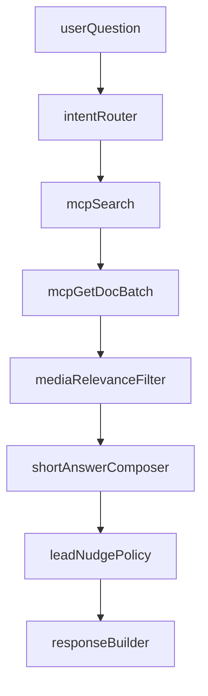

语雀智能销售助手
开发文档 V1.5

说明：本版本为可确认、可执行的开发实施文档（先文档后开发），基于已确认需求口径整理，不在本文件中直接改代码。

---

## 1. 目标与范围

### 1.1 版本目标

在不影响现有功能的前提下，新增一条「多媒体优先」问答链路，满足以下业务目标：

1. 使用语雀 Skill + MCP 作为主能力，不以向量 RAG 作为主检索链。
2. 回答风格从长篇文本改为「短文本 + 图片/视频」。
3. 图片与视频必须与用户问题相关。
4. 在多轮对话或用户停留较久后，轻量引导用户留联系方式。

### 1.2 已确认约束（最终）

- 路线：方案 1（Skill + MCP 主链）
- 图片返回上限：<= 3
- 视频返回上限：<= 1
- 文本长度：100-150 字
- 播放策略：站内播放器优先
- 无媒体回退：仅返回文本
- 留资触发：
  - 多轮触发 N = 5
  - 停留触发 T = 120s

### 1.3 范围边界

本期做：
- MCP 多文档检索增强与结果整合
- 图片/视频意图识别与优先返回
- 统一短文本输出（100-150 字）
- 前端多媒体渲染（图片 + 站内视频）
- 留资触发策略接入（N=5/T=120）

本期不做：
- 向量 RAG 主链改造
- CRM、线索分配、人工客服后台
- 新增第三方爬虫或语雀结构改造

---

## 2. 现状分析（代码基线）

当前代码中已具备：

1. 聊天编排能力（`app/service/qa_service.py`）
2. 检索与回退能力（`app/rag/retriever.py`）
3. 生成能力（`app/rag/generator.py`）
4. MCP 客户端封装（`app/data/mcp_client.py`）
5. 前端聊天渲染与流式消费（`frontend/src/App.tsx`）

### 2.1 现有痛点

1. `visitor_sales` 默认路径下 skill 路由不参与，自动策略不足。
2. 虽有 fallback，但主路径仍偏向单次命中体验，不稳定输出多媒体结果。
3. 文本输出对销售场景偏长，不符合“图/视频优先”的用户偏好。

---

## 3. V1.5 总体方案

新增「多媒体优先编排层」，不替换旧链路，采用开关灰度接入。

核心思想：
1. 先判断用户是否需要视频/图片。
2. 走 MCP 多轮检索并聚合候选文档。
3. 提取并过滤媒体 URL（相关性优先）。
4. 输出短文本（100-150 字）+ 媒体列表。
5. 根据 N=5/T=120 策略决定是否附加留资引导语。

---

## 4. 后端设计

### 4.1 新增模块

建议新增：
- `app/service/media_answer_orchestrator.py`
- `app/conversation/lead_nudge_policy.py`

#### media_answer_orchestrator 职责
- 意图识别：video/image/text
- MCP 多轮查询：search -> list_docs/get_doc
- 多文档整合：正文 + 图片URL + 视频URL
- 相关性筛选：仅保留与问题相关媒体
- 返回结构化结果供生成器使用

#### lead_nudge_policy 职责
- 会话轮次判定（N=5）
- 停留时间判定（T=120）
- 是否已留资判定（避免重复打扰）
- 生成“轻引导”文案（非强推）

### 4.2 返回结构扩展（兼容旧前端）

在 `ChatResponse` 增加可选字段（不破坏旧字段）：

- `answer_style`: `"short_sales"`
- `media`:
  - `images`: `[{url, title, doc_title, doc_id}]`
  - `videos`: `[{url, title, doc_title, doc_id}]`
- `lead_nudge_triggered`: `bool`（可选）

兼容原则：
- 旧前端忽略新增字段仍可运行
- 新前端存在字段时渲染媒体卡片

### 4.3 文本生成策略（100-150 字）

新增 V1.5 prompt 分支：
1. 先给结论
2. 再给 1-2 条精简说明
3. 有媒体时减少文字解释，避免长篇
4. 必要时追加轻量留资引导（受策略控制）

硬约束：
- 文本长度目标 100-150 字
- 无媒体时只输出短文本，不编造媒体链接

---

## 5. 前端展示适配

目标：在现有聊天 UI 上最小改造，支持媒体优先输出。

### 5.1 渲染规则

1. `images` 有值时按卡片展示（最多 3 张）
2. `videos` 有值时展示站内播放器（最多 1 条）
3. 播放失败时降级为可点击 URL
4. 文本区保持 100-150 字回答样式

### 5.2 交互规则

1. 有视频时优先显示视频模块
2. 有图片时显示图片模块
3. 无媒体仅显示文本
4. 引导留资文案显示在回答末尾（策略触发才显示）

---

## 6. 触发与策略细则

### 6.1 意图识别优先级

`视频意图 > 图片意图 > 文本意图`

示例关键词：
- 视频：视频、演示、教程、操作讲解、步骤演示
- 图片：截图、流程图、示意图、界面图、步骤图

### 6.2 留资触发

1. 多轮触发：同会话用户有效提问数 >= 5
2. 停留触发：最近一次系统输出后用户停留 >= 120 秒
3. 已留资用户：仅做承接，不重复索要

---

## 7. 分阶段实施计划

### Phase 0：文档与开关
- 固化本开发文档
- 定义 V1.5 开关（环境变量或请求参数）

### Phase 1：后端编排层
- 新增多媒体优先编排模块
- 完成 MCP 多轮检索 + 聚合 + 相关性过滤

### Phase 2：输出协议与生成
- 扩展响应结构
- 新增短文本生成分支（100-150 字）

### Phase 3：留资策略
- 接入 N=5 / T=120 策略
- 接入已留资降频逻辑

### Phase 4：前端渲染
- 图片卡片渲染
- 站内视频播放器渲染
- 无媒体降级展示

### Phase 5：回归验证
- 旧链路回归
- 新链路功能与稳定性验证

---

## 8. 测试与验收标准

### 8.1 功能验收

1. 视频类问题：返回视频 <=1 且相关
2. 图片类问题：返回图片 <=3 且相关
3. 无媒体问题：仅短文本回答（100-150 字）
4. 多轮与停留触发：N=5 / T=120 生效

### 8.2 稳定性验收

1. 旧 `/chat` 与 `/chat/stream` 可继续工作
2. 新增字段缺失时前端不报错
3. MCP 失败场景可回退到短文本

### 8.3 性能目标（建议）

1. 常规问答响应目标：<= 3s
2. 多媒体聚合场景：<= 5s

---

## 9. 风险与回退

风险 1：语雀 MCP 返回结构波动
- 对策：增加解析容错，媒体提取失败时降级文本

风险 2：多轮调用引发延迟
- 对策：限制并发、设置超时、优先高置信结果

风险 3：媒体 URL 权限导致无法播放
- 对策：站内播放器失败后降级外链，并提示用户

回退策略：
- 通过 V1.5 开关关闭新链路，回退旧逻辑

---

## 10. 交付清单

1. 本文档《开发文档V1.5》
2. 后端新增模块（编排层 + 留资策略）
3. 前端媒体渲染增强
4. 回归测试报告（旧链路与新链路）

---

## 11. V4 运行时链路（Skill + MCP + 运行追踪）

销售主链为 `POST /chat/v4/stream`（`SalesDialogOrchestratorV4`），知识来自语雀 MCP，**不走向量 RAG**。

单轮流程：

1. 会话画像 / 目录状态机（`ProfileExtractor` + `CatalogStateMachine`）
2. `plan_sales_skills()`：按问题动态选 0~N 个销售 Skill（白名单），指令拼入 prompt
3. MCP：`yuque_search` + 多次 `yuque_get_doc` 拉取主文档与关联文档
4. **一次** `generator.stream_generate` 合成对外回答
5. `debug.turn_trace`（`EXPOSE_TURN_TRACE=true` 时）：记录 `mcp_calls`、`skills`、`documents`

前端开发者面板（`VITE_SHOW_DEV_PANEL=true`）展示本轮 MCP / Skill / 文档；生产对客户建议关闭 `EXPOSE_TURN_TRACE` 与 `VITE_SHOW_DEV_PANEL`。

