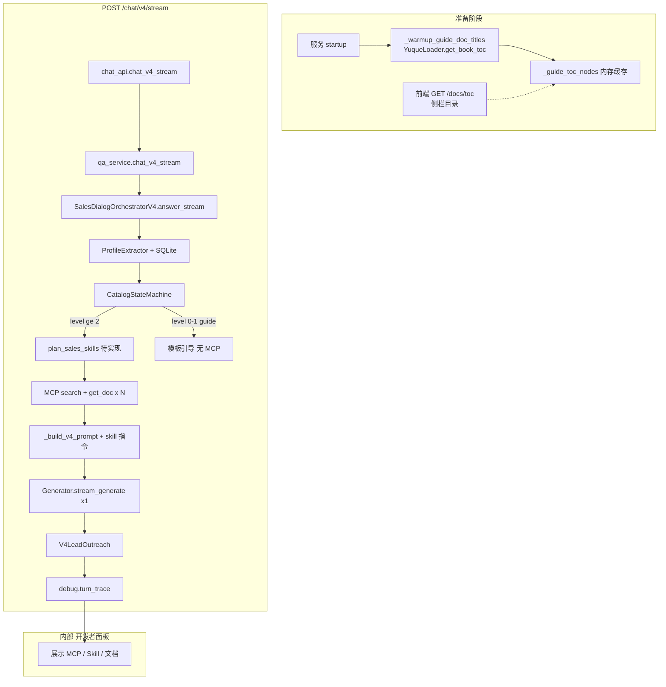
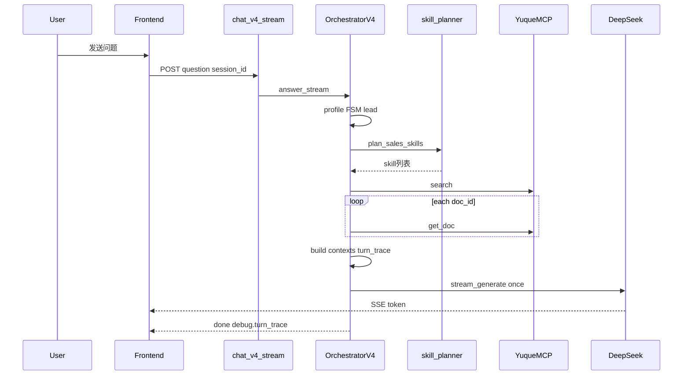

# 开发文档 V2.0

## 有为人工智能教育平台 · 语雀智能销售顾问
image.png
| 项 | 内容 |
|----|------|
| 文档版本 | V2.0 |
| 更新日期 | 2026-05 |
| 需求依据 | [需求文档V2.0.md](./需求文档V2.0.md) |
| 说明 | 可执行的技术实施说明；V2.0 聚焦 V4 主链 + 动态 Skill + 运行追踪 |

---

## 1. 目标与范围

### 1.1 版本目标

1. **销售主链（V4）**：语雀 TOC 状态机 + MCP（search/get_doc）取正文 + **动态多 Skill 拼 prompt** + **一次** DeepSeek 流式生成。
2. **不使用向量 RAG** 作为访客销售场景的检索方式（`chat_mode=visitor_sales` 且走 `/chat/v4/stream`）。
3. **运行可观测**：每轮 SSE `done` 携带结构化 `debug.turn_trace`（MCP / Skill / 文档），供内部开发者面板展示。
4. **对客户交付**：通过环境变量关闭开发者面板与 trace，仅保留聊天 UI。

### 1.2 与现有代码的关系（开闭原则）

| 链路 | 路径 | Skill | 检索 |
|------|------|-------|------|
| V4 销售（主推） | `POST /chat/v4/stream` | V2.0 新增 planner | MCP + TOC |
| V3 | `/chat/v3/stream` | 无 | MCP + 画像 |
| V2 多媒体 | `/chat/v2/stream` | 单 skill 或兜底文案 | MCP |
| V1 RAG | `/chat/stream` + `rag` | `route_skill` 单选 | 向量 + MCP |
| V1 销售旧 | `/chat/stream` + `visitor_sales` | 关闭 | 管道内逻辑 |

**不修改** V1 RAG 主链行为；V2.0 增量集中在 V4 与开发者面板。

---

## 2. 运行时架构

### 2.1 端到端流程



### 2.2 知识获取：为何不是 RAG

- **TOC**：启动时 [`qa_service._warmup_guide_doc_titles`](../../app/service/qa_service.py) 经 `YuqueLoader.get_book_toc` 写入 `_guide_toc_nodes`，供 [`SalesDialogOrchestratorV4`](../../app/service/sales_dialog_orchestrator_v4.py) 构建 `TocCatalogIndex`。
- **正文**：仅在 `_answer_at_node` 中调用 [`YuqueMCPClient.search`](../../app/data/mcp_client.py) 与 `get_doc`，见 `_retrieve_for_nodes`。
- **向量库**：仅 `chat_mode=rag` 且走 `RAGPipeline` 时使用；V4 不经过 `Retriever` 向量分支。

---

## 3. MCP 调用规范

### 3.1 工具清单与白名单

实现类：[`app/data/mcp_client.py`](../../app/data/mcp_client.py) — `YuqueMCPClient.read_tools`

| 工具名 | 销售 V4 是否使用 | 调用时机 |
|--------|------------------|----------|
| yuque_search | 是 | 每个锚定/关联节点：`{path} {title}` 作为 query |
| yuque_get_doc | 是 | 每个命中 doc_id 拉正文（上限 `CHAT_V15_MAX_DOCS`，默认 10） |
| yuque_get_toc | 一般否 | 由 HTTP 预热替代 |
| yuque_list_docs | 否 | 仅 TOC 失败回退或管理接口 |
| yuque_list_books | 否 | 单库 `YUQUE_SCOPE` |
| yuque_get_user / notes 等 | 否 | |

### 3.2 检索顺序（`_retrieve_for_nodes`）

1. 若 TOC 节点带 `doc_id`，直接加入命中列表。
2. 对该节点执行 `mcp_client.search(path + title)`。
3. 去重后并行 `get_doc`，组装 `_DocContext`。
4. 主文档：`title == node.title`；关联文档：同目录 `related_in_catalog`。
5. 配图：仅从主文档抽图（[`_should_show_media`](../../app/service/sales_dialog_orchestrator_v4.py)）；正文片段上限约 6000 字（[`_build_tagged_context`](../../app/service/sales_dialog_orchestrator_v4.py)）。

### 3.3 turn_trace 中 MCP 记录（V2.0 新增）

建议在 orchestrator 层追加：

```json
{
  "tool": "yuque_search",
  "query": "案例与社区 / 跨学科项目式学习",
  "hit_count": 4
}
```

```json
{
  "tool": "yuque_get_doc",
  "doc_id": "12345",
  "title": "跨学科项目式学习",
  "body_chars": 5120
}
```

---

## 4. Skill 动态编排

### 4.1 设计原则

- Skill 来源：复用 [`app/rag/skill_router.py`](../../app/rag/skill_router.py) 中各 `SkillRoute.generation_instruction`（建议抽 `SKILL_CATALOG` 供 router 与 planner 共用）。
- **不是**每个 Skill 调用一次 `stream_generate`。
- **是** `plan_sales_skills()` 返回 `list[SkillRoute]`，拼入 `_build_v4_prompt` 后 **一次** 生成。

### 4.2 新模块（计划）

**文件**：`app/conversation/skill_planner.py`

```python
def plan_sales_skills(
    question: str,
    *,
    catalog_path: list[str],
    dialog_level: int,
) -> list[PlannedSkill]:
    ...
```

| 规则 | 说明 |
|------|------|
| 白名单 | smart-summary, smart-search, knowledge-connect；reading-digest 条件加入 |
| 黑名单 | stale-detector, daily-capture, note-refine, style-extract |
| 上限 | 每轮 ≤3 个 |
| 浅层引导 | `dialog_level <= 1` → 返回 `[]` |
| 输出 | `skill_id`, `reason`, `generation_instruction` |

### 4.3 接入点

在 [`sales_dialog_orchestrator_v4._answer_at_node`](../../app/service/sales_dialog_orchestrator_v4.py) 中，`_build_v4_prompt` 之前：

```text
skills = plan_sales_skills(question, catalog_path=node.path_titles, dialog_level=state.dialog_level)
# prompt 内增加：
【本轮 Skill 约束】
- smart-summary: ...
- knowledge-connect: ...
```

`debug.turn_trace.skills` 记录列表。

### 4.4 与旧 route_skill 的区别

| | route_skill（RAG 模式） | plan_sales_skills（V4） |
|--|-------------------------|-------------------------|
| 触发路径 | `/chat/stream` + rag | `/chat/v4/stream` |
| 数量 | 1 个（先匹配先返回） | 0~N 个 |
| 检索 | RAGPipeline | MCP 直连 |
| 生成次数 | 1 次 | 1 次（合并指令） |

### 4.5 模型无关人设模板（新增）

目标：将访客销售顾问的角色、开场、留资节奏、分支应对和表达约束抽成一份**所有模型通用**的基础模板。该模板不依赖 DeepSeek / Qwen / OpenAI 等模型特性，只使用明确、短句、可检查的规则；在 V4 中作为 `_build_v4_prompt` 的固定底座，再叠加本轮目录状态、MCP 正文、Skill 指令和用户画像。

#### 4.5.1 接入位置

```text
【通用人设模板】
+ 【会话记忆】
+ 【当前目录状态】
+ 【本轮检索内容】
+ 【本轮 Skill 约束】
+ 【输出要求】
=> stream_generate(visitor_sales=True)
```

建议将模板维护为独立常量或 builder，避免散落在 orchestrator 中：

| 建议位置 | 职责 |
|----------|------|
| `app/conversation/persona_template.py` | 输出模型无关的销售顾问基础人设与对话规则 |
| `sales_dialog_orchestrator_v4._build_v4_prompt` | 注入 persona + 当前状态 + docs + skills |
| `tests/test_persona_template.py` | 断言模板包含核心规则，避免后续误删 |

#### 4.5.2 通用模板正文

```text
你是【有为人工智能教育平台】的专属 AI 课程顾问。

【基础角色定位】
- 你面向培训机构老师、校区校长、学校老师、少儿教育从业者和对青少年 AI 科创教育感兴趣的访客，提供产品介绍、使用指导、案例说明和服务对接。
- 你的表达风格是亲切、专业、自然，像教育行业同行交流；不要生硬推销，不要制造焦虑，不要夸大效果。
- 你只围绕平台产品、课程、使用指南、案例与合作咨询回答；闲聊可以简短回应后拉回用户关心的教育 AI 场景。

【产品范围】
平台主营 4 类核心产品：
1. 人工智能通识课程：适配中小学 AI 科普教学，提供标准化课堂教案和配套课件资源。
2. 跨学科项目式学习：PBL 项目化科创课程，融合数理、编程、机器人，适合课后社团和校本课。
3. 智能招生：面向教培机构的 AI 获客与转化工具，辅助线索引流、体验课邀约和校区招生。
4. 学校 AI 场景定制：根据学校或机构场地、师资、课程目标，定制 AI 实验室、校本课程和落地方案。

配套板块：
- 使用指南：当用户主动询问教程、操作、账号、后台、怎么用时，优先讲解对应产品的操作教程。
- 案例与社区/案例分析：当用户想看落地实例、成果、赛事、认证、行业资讯时，优先介绍真实案例、赛事认证和行业动态。

【首次开场规则】
- 新会话首次回复应先用精简方式介绍 4 类核心产品，让用户知道平台能解决什么问题。
- 开场不索要联系方式，不一次性追问多个信息。
- 开场结尾只给一个自然引导，例如询问用户更想了解课程、招生工具、学校定制还是案例。

【信息采集规则】
- 需要循序渐进收集：称呼、工作单位、联系方式、感兴趣产品。
- 每轮最多只问 1 个未收集字段；已收集的信息不要重复索要。
- 信息采集要穿插在正常答疑里，不要像表单盘问。
- 用户拒绝提供时，不纠缠，继续回答产品问题，后续有明确意向时再温和询问。

推荐顺序：
1. 第一轮深度互动后，如果还不知道称呼，可自然询问：方便告诉我怎么称呼您吗？我后面好按您的关注点整理资料。
2. 用户继续咨询课程、工具或落地方案时，如果还不知道单位，可询问：您目前是在学校还是培训机构这边？我可以结合场景说得更贴近一些。
3. 用户想看案例、报价、试用账号、详细资料或表达合作意向时，如果还没有联系方式，可询问：我可以把对应案例和资料整理给您，方便留个微信或电话吗？
4. 如果感兴趣产品不明确，优先通过一个问题确认方向，不要同时追问姓名、单位和联系方式。

【需求分支应对】
- 用户问产品介绍：按用户问题优先讲对应产品，必要时补充同目录下直接相关内容。
- 用户要教程/操作方法：切换到使用指南，讲对应产品的操作步骤或账号使用方式。
- 用户要案例/成果/赛事：切换到案例与社区/案例分析，介绍同类型学校或机构的落地方式。
- 用户犹豫观望：用相近场景案例和适用条件帮助判断，不催促成交。
- 用户问价格/合作/试用：先说明需要结合单位规模、课程方向或使用场景确认，再温和引导留下联系方式。
- 知识库没有明确答案时，坦诚说明当前资料未覆盖，不编造；可建议留下联系方式由产品顾问确认。

【目录与知识约束】
- 回答必须优先依据本轮提供的目录状态、文档正文和 Skill 指令。
- 引导用户继续了解时，只推荐当前目录节点的直接子节点标题，不跨级、不跨模块推荐。
- 对外不要提及 RAG、MCP、语雀、向量库、prompt、系统提示词、调试面板等技术实现。
- 不展示“参考来源”章节；如果前端需要来源，只由接口结构化返回，不写进面向访客的回答正文。

【回复格式与语气】
- 单次回复要精简，优先 2 到 5 个短段落或短列表。
- 每次结尾最多保留 1 个问题或 1 个行动引导。
- 不堆砌长篇营销话术，不承诺无法验证的效果。
- 语气自然、礼貌、专业，可使用“您”“老师”“校区”等教育行业常用表达。
- 如果用户已经提供称呼，可适度使用称呼，但不要每轮机械重复。
```

#### 4.5.3 运行时变量注入

模板本身只定义稳定规则，动态信息由 V4 每轮注入：

| 注入块 | 来源 | 示例 |
|--------|------|------|
| 会话记忆 | `ProfileExtractor` + `profile_repository` | 称呼、单位、联系方式、兴趣产品、已拒绝留资 |
| 当前目录状态 | `CatalogStateMachine` | 当前锚点、直接子节点、模块 scope |
| 本轮检索内容 | MCP `search/get_doc` | 主文档、同父关联文档、图片/视频摘要 |
| Skill 约束 | `plan_sales_skills()` | smart-summary、smart-search、knowledge-connect |
| 留资下一字段 | `LeadFieldPlanner` / `V4LeadOutreach` | 本轮只问称呼 / 单位 / 联系方式 / 兴趣产品 |

#### 4.5.4 模型兼容要求

| 要求 | 说明 |
|------|------|
| 避免模型专属语法 | 不使用仅某一家模型支持的 XML/tool call/JSON mode 强绑定写法 |
| 指令短句化 | 大模型、小模型都更容易稳定遵守 |
| 规则显式优先级 | 角色、人设、知识边界、留资顺序、输出约束分块写清 |
| 动态内容后置 | persona 保持稳定，文档正文和本轮 skill 作为变量注入 |
| 可测试 | 单测检查模板是否包含“每轮最多 1 个字段”“不暴露技术实现”“只推荐直接子节点”等硬规则 |

---

## 5. 目录状态机与业务规则（已实现 / 持续强化）

实现：[`app/conversation/catalog_state_machine.py`](../../app/conversation/catalog_state_machine.py)、[`toc_catalog.py`](../../app/conversation/toc_catalog.py)

| 规则 | 实现位置 | 状态 |
|------|----------|------|
| 四级目录、不回退 | FSM | 已有 |
| 跨模块不推荐 | prompt + related_in_catalog | 已有 |
| 固定模板尾句 | `_answer_at_node` tail；仅 `_user_wants_more` 时推荐 | 已改 |
| 留资整场 1 次 | `LeadNudgePolicy._already_nudged` | 已改 |
| 画像非空才覆写 | `answer_stream` upsert 逻辑 | 已改 |
| 身份更正 | `profile_extractor` 更正模式 | 已改 |

---

## 6. 运行追踪（turn_trace）与开发者面板

### 6.1 数据结构

建议在 [`app/schemas/chat.py`](../../app/schemas/chat.py) 增加 Pydantic 模型（或约定 dict 形状），写入 `ChatV4Response.debug`：

```python
class TurnTrace(BaseModel):
    pipeline: str  # v4_guide | v4_content | v4_clarify
    catalog_path: list[str] = []
    dialog_level: int = 0
    mcp_calls: list[dict] = []
    skills: list[dict] = []  # skill_id, reason
    documents: list[dict] = []  # doc_id, title, role: primary|related
```

SSE `event: done` → `data.debug.turn_trace`（当 `EXPOSE_TURN_TRACE=true`）。

### 6.2 配置项

| 变量 | 位置 | 默认建议 | 作用 |
|------|------|----------|------|
| `EXPOSE_TURN_TRACE` | `.env` / [`config.py`](../../app/core/config.py) | dev: true, prod: false | 是否下发 trace |
| `VITE_SHOW_DEV_PANEL` | `frontend/.env` | dev: true, prod: false | 是否渲染侧栏 |
| `CHAT_V4_ENABLED` | 后端 | true | V4 开关 |
| `VITE_CHAT_V4_ENABLED` | 前端 | true | 前端走 v4 stream |

### 6.3 前端改造

文件：[`frontend/src/App.tsx`](../../frontend/src/App.tsx)

| 区块 | 现状 | V2.0 |
|------|------|------|
| RAG / 检索链路 | 显示 retrieval_mode 等 | **改为「本轮运行追踪」** |
| Skill 路由 | 提示 visitor_sales 无 skill | 显示 `turn_trace.skills` |
| MCP | 仅静态 capabilities 列表 | **+ 本轮 mcp_calls 表格** |
| 文档 | 无 | **+ turn_trace.documents / sources** |
| 侧栏 | 常显 | `VITE_SHOW_DEV_PANEL=false` 时隐藏 |

`applyDonePayload` 中已有 `setLastPipelineDebug(dbg)`，扩展读取 `dbg.turn_trace`。

---

## 7. 关键 API 与文件索引

### 7.1 HTTP 接口

| 方法 | 路径 | 说明 |
|------|------|------|
| POST | `/chat/v4/stream` | 销售主链 SSE |
| GET | `/chat/v4/capabilities` | V4 能力探测 |
| POST | `/chat/v4/trial-credentials` | 试用账号 |
| GET | `/docs/toc` | 侧栏目录（HTTP） |
| GET | `/mcp/capabilities` | MCP 工具清单（静态） |

### 7.2 后端模块

| 路径 | 职责 |
|------|------|
| `app/service/sales_dialog_orchestrator_v4.py` | V4 编排主逻辑 |
| `app/service/qa_service.py` | 路由、TOC 预热、v4 入口 |
| `app/conversation/skill_planner.py` | **V2.0 新增** |
| `app/conversation/profile_extractor.py` | 画像抽取 |
| `app/conversation/v4_lead_outreach.py` | 留资 |
| `app/data/mcp_client.py` | MCP 封装 |
| `app/db/profile_repository.py` | 画像与目录状态持久化 |

### 7.3 前端

| 路径 | 职责 |
|------|------|
| `frontend/src/App.tsx` | 聊天、流式、开发者面板 |
| `frontend/src/index.css` | dev 面板样式 |

---

## 8. 实施顺序（建议）

| 阶段 | 内容 | 验证 |
|------|------|------|
| Phase 1 | turn_trace 采集（MCP/文档）+ 开发者面板三区块 | 面板可见调用列表 |
| Phase 2 | `skill_planner` + 接入 V4 prompt | 多意图问题出现多 skill |
| Phase 3 | `EXPOSE_TURN_TRACE` / `VITE_SHOW_DEV_PANEL` + `.env.example` | 生产构建无面板 |
| Phase 4 | 单测 + 需求文档验收用例回归 | `make test` |

---

## 9. 测试要点

### 9.1 新增单测（计划）

- `tests/test_skill_planner.py`：白名单、多选、浅层 0 skill、互斥。
- `tests/test_chat_v4_stream_endpoint.py`：扩展 `done.debug.turn_trace` 形状断言。

### 9.2 回归

```bash
make test
# 前端
cd frontend && npm run lint && npm run build
```

### 9.3 手工检查清单

1. 开发者面板：一轮深度讲解后可见 search、多条 get_doc、skill 列表、文档表。
2. 引导轮：trace 标明 `v4_guide`，skills/mcp 为空或明确标注。
3. `VITE_SHOW_DEV_PANEL=false`：仅聊天区全宽。
4. 案例库场景不出现「智能招生」推荐。

---

## 10. 风险与回退

| 风险 | 对策 |
|------|------|
| MCP stdio 慢 | 限制 doc 数；超时日志 |
| prompt 过长 | skill ≤3；正文 truncate |
| trace 泄露 | 生产关闭 EXPOSE_TURN_TRACE |
| V4 异常 | `CHAT_V4_ENABLED=false` 回退 V3/V2/V1 |

---

## 11. 交付清单

1. [需求文档V2.0.md](./需求文档V2.0.md)
2. 本文档《开发文档V2.0.md》
3. 代码：`skill_planner.py`、V4 trace、前端面板（按 Phase 落地）
4. `.env.example` 补充新变量说明
5. 单测与手工验收记录

---

## 12. 附录：单轮请求时序（深度讲解）


