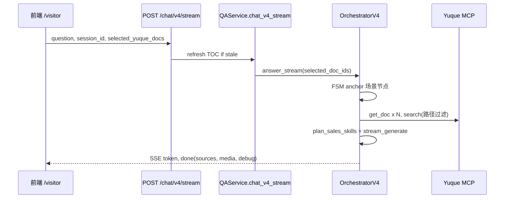
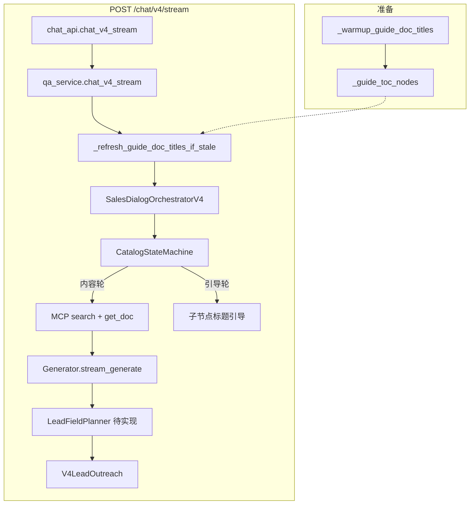

# 开发文档 V3

## 有为人工智能教育平台 · 语雀智能销售顾问

| 项 | 内容 |
|----|------|
| 文档版本 | V3 |
| 需求依据 | [需求文档V3.md](./需求文档V3.md) |
| 实施链路 | **全部在 V4 接口上完成**（`POST /chat/v4/stream` 等） |
| 关联文档 | [开发文档 V2.0](./开发文档V2.0.md)（V4 运行时、MCP、trace） |
| 更新日期 | 2026-05 |
| 说明 | 将需求文档 V3 的五大部分映射为可执行的 V4 改造说明；**不扩展** `/chat/v3/stream` |

---

## 0. 需求与实现对应关系

需求文档 V3 描述的是**产品行为**；本开发文档规定**如何在现有 V4 代码上落地**。

```text
需求文档 V3（产品）          开发文档 V3（本文）              代码 / 接口（V4）
─────────────────────────────────────────────────────────────────────────
一、项目基础现状      →    §1 架构基线 + V4 已有能力表      SalesDialogOrchestratorV4
二、现存全部问题      →    §2 问题根因（对照 V4 代码）      catalog_state_machine 等
三、多级目录引导      →    §3 V4 改造设计                  TocCatalogIndex / FSM
四、对话全流程        →    §4 时序与状态                  /chat/v4/stream
五、技术改造清单      →    §5 任务表（文件级）            qa_service / App.tsx
六、核心总结          →    §9 验收标准
```

**开闭原则**：访客销售主链固定为 V4；V3 API（`/chat/v3/stream`）为历史旁路，本规格不向其增加目录状态机或多文档能力。

| 链路 | HTTP | 编排器 | 本规格 |
|------|------|--------|--------|
| **V4 销售（实施对象）** | `POST /chat/v4/stream` | `SalesDialogOrchestratorV4` | **是** |
| V3 画像推荐 | `POST /chat/v3/stream` | `SalesDialogOrchestratorV3` | 否 |
| V2 多媒体 | `POST /chat/v2/stream` | `MediaAnswerOrchestrator` | 否 |
| V1 RAG | `POST /chat/stream` | `RAGPipeline` | 否 |

---

## 1. 项目基础现状（对应需求 §一）

### 1.1 技术架构与依赖

| 需求项 | V4 实现说明 |
|--------|-------------|
| 无语雀 RAG 框架，Skill + MCP + 官方接口 | 访客销售 `chat_mode=visitor_sales` 且走 `/chat/v4/stream` 时**不走向量检索**；正文来自 `YuqueMCPClient.search` + `get_doc` |
| Skill 单次对话 1 个为主 | [`skill_planner.plan_sales_skills`](../../app/conversation/skill_planner.py) 规划后拼入 prompt，核心含 **smart-summary** |
| MCP 可多次调用 | [`_retrieve_for_nodes`](../../app/service/sales_dialog_orchestrator_v4.py) 对多节点 search + get_doc |
| 知识库模块：平台介绍/案例分析 + 使用指南 | **待增强**：会话级 `module_scope`（或 `interests` 标记）切换子树；默认锚在「平台介绍」 |
| 左侧场景按钮 | **待改造**：`frontend/src/App.tsx` 中 `FOCUS_SCENE_ITEMS` 仍硬编码 |

### 1.2 V4 已实现能力（改造基线）

| 能力 | 模块路径 |
|------|----------|
| TOC 树索引 | `app/conversation/toc_catalog.py` → `TocCatalogIndex.children_of` |
| 目录状态机 | `app/conversation/catalog_state_machine.py` → `CatalogStateMachine` |
| 状态持久化 | `app/db/profile_repository.py` → `catalog_state_json` |
| 流式编排 | `app/service/sales_dialog_orchestrator_v4.py` |
| 会话画像 | `app/conversation/profile_extractor.py` |
| 留资 / 试用 | `app/conversation/v4_lead_outreach.py` + `POST /chat/v4/trial-credentials` |
| TOC 内存缓存 | `app/service/qa_service.py` → `_guide_toc_nodes`，`CHAT_V15_GUIDE_REFRESH_S`（默认 300s） |
| 前端 V4 切流 | `frontend/src/App.tsx` → `chatV4Enabled` ? `/chat/v4/stream` |

### 1.3 核心业务规则（需求固定，V4 落地方式）

| 规则 | V4 落地要点 |
|------|-------------|
| 销售口吻、精简 | `_build_v4_prompt` + `Generator.stream_generate(visitor_sales=True)` |
| 每轮仅问 1 项信息 | **待实现** `LeadFieldPlanner`：姓名 → 单位 → 联系方式 → 感兴趣产品 |
| 引导匹配语雀标题 | 引导轮仅输出 `children_of(anchor).title` |
| 使用指南 + 测试账号 | `detect_intent_flags` + `V4LeadOutreach` + `trial-credentials` |
| 模块切换与场景重置 | FSM `reset` + 清空 `catalog_state_json`；前端新场景换 session 或调 reset |

### 1.4 目标单轮输出结构（需求 §四）

```text
多文档讲解（Skill 摘要 + 流式正文）
+ 1 项信息提问（不重复）
+ 同级目录引导（仅当前节点直接子节点标题）
```

---

## 2. 现存问题与 V4 根因（对应需求 §二）

| 需求问题 | V4 根因（代码级） | 改造方向 |
|----------|-------------------|----------|
| **问题1** 同名标题冲突 | `_retrieve_for_nodes` 用 `path_prefix + title` 做 search，未按子树 **硬过滤** hit | search 结果校验 `path_titles` 前缀；优先 `node.doc_id` → `get_doc` |
| **问题2** 单场景单文档 | 场景点击发自然语言；深度轮虽 `related_in_catalog`，但未拉**同父下全部 doc 子节点** | `selected_yuque_docs` / `anchor_toc_uuid`；批量 get_doc |
| **问题3** 目录层级与缓存 | ① `guide_candidates` 在 level=2 无子节点时用 `related_in_catalog`（跨兄弟）② `dialog_level` 将 depth≥3 均视为 3 ③ 前端硬编码 ④ TOC 进程缓存 | 见 §3 |
| **问题4** 信息采集节奏 | `LeadNudgePolicy` 满 N 轮/停留过久才 append，且可一次列多项 | `LeadFieldPlanner` 每轮 1 字段 + prompt 约束 |

---

## 3. 多级目录平行引导（对应需求 §三）

### 3.1 数据模型

语雀 `yuque_get_toc` / `YuqueLoader.get_book_toc` 返回扁平节点，由 `TocCatalogIndex` 建树。字段：`uuid`、`parent_uuid`、`title`、`doc_id`、`children`。

需求示例树见 [需求文档V3.md §三](./需求文档V3.md)；层级深度**不设代码上限**，只维护 **当前锚点 `node_uuid`**。

### 3.2 产品规则 → 状态机行为

| 需求规则 | `CatalogStateMachine` / 会话状态 |
|----------|----------------------------------|
| 初始锚定「平台介绍」，引导二级子节点 | `node_uuid` = 平台介绍 uuid；`guide_candidates` = `children_of(平台介绍)` |
| 进入子节点后只引导其子节点 | `apply_user_turn` anchor 后，`children_of(当前节点)` |
| 返回上一级 | 识别「返回上一级」等 → `parent_uuid` 对应节点 |
| 点击左侧新场景 | 重置 `CatalogDialogState`，锚定该二级节点 |

**统一原则（需求 §三.2）**：AI 与前端菜单**仅展示当前节点的直接子节点**，不跨级、不跨分支。

### 3.3 V4 代码改造

#### 3.3.1 `guide_candidates` 收敛（P0）

**现状**（`catalog_state_machine.py`）：按 `dialog_level` 分支；level=2 无子节点时退回 `related_in_catalog`。

**目标**：

```python
def guide_candidates(self, state: CatalogDialogState, node: Optional[CatalogNode]) -> List[CatalogNode]:
    anchor = node or (self._catalog.get(state.node_uuid) if state.node_uuid else None)
    if anchor is None:
        anchor = self._catalog.match_node("平台介绍", current=None, prefer_subtree=False)
        if anchor is None and self._catalog.roots:
            anchor = self._catalog.roots[0]
    return self._catalog.children_of(anchor)[:6]
```

`related_in_catalog` **仅**用于内容讲解时的关联阅读，**不得**作为引导候选。

#### 3.3.2 TOC 实时刷新（P0）

| 机制 | 说明 |
|------|------|
| 已有 | `chat_v4_stream` 入口调用 `_refresh_guide_doc_titles_if_stale()` |
| 配置 | `CHAT_V15_GUIDE_REFRESH_S`（默认 300）；`0` 表示仅 force 刷新 |
| **待新增** | `POST /chat/v4/refresh-toc` → `_refresh_guide_doc_titles_if_stale(force=True)` |
| 场景切换 | 前端点击新场景前调用 refresh；或 `GUIDE_REFRESH_S=0` + 每轮 force |

**待改造**：`SalesDialogOrchestratorV4` 每轮使用**刷新后**的 `_guide_toc_nodes` 重建 `TocCatalogIndex`，避免构造时快照过期。

#### 3.3.3 `get_direct_children`（P0）

需求伪代码对应现有 API：

```python
# toc_catalog.py
def children_of(self, node: Optional[CatalogNode]) -> List[CatalogNode]:
    if not node:
        return list(self._roots)
    return list(node.children)
```

文档中的 `get_direct_children(current_node)` 即 **`TocCatalogIndex.children_of`**，引导与前端菜单统一调用。

#### 3.3.4 前端左侧菜单（P0）

**文件**：`frontend/src/App.tsx`

| 现状 | 目标 |
|------|------|
| `FOCUS_SCENE_ITEMS` 常量 4 项 | 从 `GET /chat/v2/guide-titles` 或 `GET /docs/toc` 取「平台介绍」的 `children` 动态渲染 |
| 点击发 `我想要咨询${scene}…` | 传 `selected_yuque_docs: [{doc_id}]` 或 **待新增** `anchor_toc_uuid` |

#### 3.3.5 同名文档（P1 / P2）

| 优先级 | 方案 |
|--------|------|
| P1 | `_retrieve_for_nodes`：过滤 search 结果，要求 hit 路径在锚点子树内 |
| P2 | 语雀运营：标题加 `【平台介绍】` / `【使用指南】` 前缀 |

---

## 4. 对话全流程（对应需求 §四）

### 4.1 通用结构

每轮 SSE `done` 前流式输出应满足：

```text
[内容] 多文档正文 + Skill 摘要
[采集] 恰好 1 个未填字段的自然提问
[引导] 当前锚点直接子节点标题（≤6 个）
```

### 4.2 流程 1：首次点击左侧场景



| 需求步骤 | V4 实现 |
|----------|---------|
| get_toc 最新目录 | `qa_service._refresh_guide_doc_titles_if_stale` |
| search + 多篇 get_doc | `_retrieve_for_nodes`（扩展同父多 doc） |
| smart-summary | `skill_planner` → prompt |
| 锚定二级节点 | `selected_doc_ids` 强制 anchor 或 FSM `match_node` |
| 输出：讲解 + 首问 + 子节点引导 | `_answer_at_node` + `LeadFieldPlanner` + 简化 `guide_candidates` |

### 4.3 流程 2：常规多轮

1. 读 `catalog_state_json`、`chat_session_profiles`。
2. `ProfileExtractor.extract_update` 更新画像。
3. `LeadFieldPlanner.next_missing()` → 写入 `_build_v4_prompt`。
4. `dialog_level >= 2` 或 `action == anchor` → `_answer_at_node`；否则引导轮（仅子节点文案，无 MCP 或轻量 MCP）。

### 4.4 流程 3：使用指南

| 需求分支 | V4 设计 |
|----------|---------|
| 直接索要指南 | 设 `module_scope=使用指南` → 检索该子树 → 立即摘要 + 试用引导 |
| 对话中提及 | 单轮切换 scope，回答后清除，回到平台介绍锚点 |
| 同意测试账号+指南 | `V4LeadOutreach` 补全字段 → `POST /chat/v4/trial-credentials` |

**待实现**：`module_scope` 字段（`profile.interests` 或新列）。

### 4.5 流程 4：切换新场景

1. 前端：新 `session_id` 或 `reset_session` + `POST /chat/v4/refresh-toc`。
2. 后端：`CatalogDialogState()` 写库；可选清空消息历史。
3. 锚定「平台介绍」下用户所选二级节点。

---

## 5. 技术改造清单（对应需求 §五）

| 优先级 | 需求模块 | 主要文件 | 工作内容 | 验收要点 |
|--------|----------|----------|----------|----------|
| **P0** | MCP 目录缓存 | `qa_service.py`, `chat_api.py` | 新增 `POST /chat/v4/refresh-toc`；场景切换 force 刷新 | 语雀改 TOC 后手动刷新即生效 |
| **P0** | 目录层级逻辑 | `catalog_state_machine.py` | `guide_candidates` 仅 `children_of(anchor)` | 引导标题 ⊆ 直接子节点 |
| **P0** | Orchestrator 热 TOC | `qa_service.py`, `sales_dialog_orchestrator_v4.py` | 每轮用最新 `_guide_toc_nodes` 建索引 | 与语雀结构一致 |
| **P0** | 前端左侧菜单 | `App.tsx` | 动态 children；传 doc_id/uuid | 无硬编码场景名 |
| **P1** | 多文档读取 | `sales_dialog_orchestrator_v4.py` | 同父多 `doc_id` + smart-summary | `done.sources` 多条 |
| **P1** | 文档检索规则 | `_retrieve_for_nodes` | 子树路径 / uuid 过滤 | 同名标题不串模块 |
| **P1** | 信息采集 | `v4_lead_outreach.py`, `_build_v4_prompt` | `LeadFieldPlanner` 每轮 1 问 | 连续轮次各填 1 字段 |
| **P1** | 使用指南 scope | orchestrator v4 | 模块切换与回退 | 指南后回到平台介绍 |
| **P2** | 标题优化 | 语雀运营规范 | 【模块】前缀 | 人工抽检无歧义 |

---

## 6. V4 接口与配置

### 6.1 HTTP 接口

| 方法 | 路径 | 说明 |
|------|------|------|
| POST | `/chat/v4/stream` | **主对话** SSE |
| POST | `/chat/v4` | 非流式（同逻辑） |
| GET | `/chat/v4/capabilities` | `enabled`, `toc_loaded`, `catalog_state_enabled` |
| POST | `/chat/v4/trial-credentials` | 试用账号下发 |
| GET | `/chat/v2/guide-titles` | TOC 树（含嵌套 `children`） |
| GET | `/docs/toc` | 侧栏文档元数据（HTTP 实时） |
| POST | `/chat/v4/refresh-toc` | **待实现**：强制刷新 V4 用 TOC |

### 6.2 请求体（`ChatV4Request`）

继承 [`ChatRequest`](../../app/schemas/chat.py)：

| 字段 | 说明 |
|------|------|
| `question` | 用户输入 |
| `chat_mode` | 固定 `visitor_sales` |
| `session_id` | 驱动画像 + `catalog_state_json` |
| `owner` / `token_profile` | 语雀 scope |
| `selected_yuque_docs` | `{ doc_id, title?, slug? }[]`，优先 doc_id 锚定 |
| `anchor_toc_uuid` | **待实现**：显式目录锚点 |

### 6.3 SSE 事件

| event | 说明 |
|-------|------|
| `stage` | retrieving / generating / vision |
| `token` | 流式文本 |
| `done` | `ChatV4Response`：answer, sources, media, trial_apply_available, debug |
| `error` | 错误信息 |

### 6.4 环境变量

| 变量 | 默认 | 作用 |
|------|------|------|
| `CHAT_V4_ENABLED` | false | 后端 V4 开关 |
| `VITE_CHAT_V4_ENABLED` | false | 前端走 v4 stream |
| `CHAT_V15_GUIDE_REFRESH_S` | 300 | TOC 缓存 TTL（秒） |
| `CHAT_V15_MAX_DOCS` | 6 | 单轮最多文档数 |
| `CHAT_V15_LEAD_NUDGE_ROUNDS` | 5 | 留资兜底阈值（改造后降级） |
| `EXPOSE_TURN_TRACE` | true | 生产对客户建议 false |

本地启用示例见 [.env.example](../../.env.example)。

---

## 7. 运行时架构（V4）



更细的 MCP、Skill、trace 说明见 [开发文档 V2.0 §2–§6](./开发文档V2.0.md)。

---

## 8. 实施顺序（建议）

| 阶段 | 内容 | 验证 |
|------|------|------|
| Phase 0 | 开启 `CHAT_V4_ENABLED` + `VITE_CHAT_V4_ENABLED`，确认 `/visitor` 走 v4 | `GET /chat/v4/capabilities` → enabled |
| Phase 1 | P0：guide_candidates、refresh-toc、热 TOC、动态场景栏 | 语雀增 4 级目录可见；引导不跨分支 |
| Phase 2 | P1：多文档、检索过滤、LeadFieldPlanner、使用指南 scope | 单轮单问；同名不串库 |
| Phase 3 | P2 运营标题规范 + 回归测试 | `make test`；手工 visitor 走查 |

---

## 9. 验收标准（对应需求 §六）

1. **无限级目录**：语雀新增 4/5 级后，不改代码即可在引导中出现（刷新 TOC 后）。
2. **同级引导**：任意时刻推荐标题 = `children_of(anchor)` 的 title 子集。
3. **多文档**：点击场景后 trace / sources 显示多篇 get_doc。
4. **信息采集**：连续对话每轮最多新增 1 个画像字段的追问，已填字段不再问。
5. **同名隔离**：固定测试用例下，锚定在 A 子树不返回 B 子树正文。
6. **回退**：`CHAT_V4_ENABLED=false` 时 v4 返回 503，前端回退 v3/v2 不影响其他链路。

---

## 10. 测试

```bash
make test
# 重点用例
# tests/test_chat_v4_stream_endpoint.py
# tests/test_catalog_state_machine.py（引导候选待更新后扩展）
cd frontend && npm run lint && npm run build
```

手工：`make dev` → `http://127.0.0.1:8000/visitor` → 改语雀 TOC → 调 refresh-toc → 看左侧与 AI 引导是否一致。

---

## 11. 需求章节索引

| 需求文档 V3 章节 | 本文档章节 |
|------------------|------------|
| 一、项目基础现状 | §1 |
| 二、现存全部问题 | §2 |
| 三、多级目录平行引导 | §3 |
| 四、整体对话全流程 | §4 |
| 五、技术改造清单 | §5 |
| 六、核心总结 | §9 |

---

## 12. 变更记录

| 日期 | 说明 |
|------|------|
| 2026-05 | 基于 [需求文档V3.md](./需求文档V3.md) 初版生成；明确全部改造落在 V4 接口 |
| 2026-05 | 补充代码路径、接口表、待实现项（`refresh-toc`、`anchor_toc_uuid`、`LeadFieldPlanner`、`module_scope`） |
