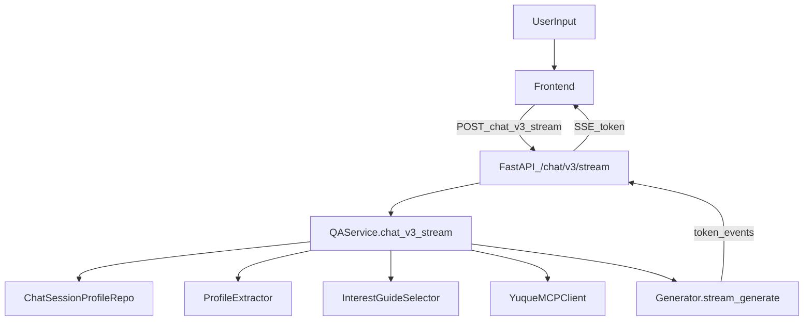

## 目标与验收
- **记忆**：在同一 `session_id` 内，能稳定记住并复用用户已提供信息（姓名/身份/单位/兴趣点/已聚焦主题），至少影响：开场称呼、后续不重复问身份、推荐方向更贴合。
- **不机械引导**：当用户不明确（“我不知道选哪个/随便看看/你推荐”）时，**基于当前问题+历史兴趣点**从语雀 TOC/标题中推荐 **3 个最相关方向**，不暴露“一级/二级/目录树”。
- **模糊匹配触发**：用户不输入完整标题时，仍能通过 LLM 扩写/归因到 1-3 个候选标题或主题，并触发 MCP 检索。
- **跟进问答**：当用户对已讲解内容追问时，不再回到“关键词引导”，而是优先用“已聚焦文档集合”回答；不足再扩检。
- **开闭原则**：不改动既有 v1/v2 行为；通过 **新增 v3 API + 新 service/module + 新表** 实现。

## 现状要点（基于代码）
- 会话消息已落库：`app/db/repositories.py` 的 `ChatSessionRepository`/`chat_messages`。
- v2 多媒体编排：`app/service/media_answer_orchestrator.py` 已有 TOC 引导与 `detect_visitor_type` 的“历史回看”。
- v2 请求/响应 schema：`app/schemas/chat.py`。
- 前端按探测接口决定走 v2：`frontend/src/App.tsx` 会探测 `/chat/v2/guide-titles` 并切 `/chat/v2/stream`。

## 方案：新增 v3 旁路（推荐）
### 1) 新增会话画像存储（服务端持久化）
- 新表 `chat_session_profiles`（避免改原表结构）：
  - `session_id` (PK)
  - `display_name`（姓名/称呼）
  - `visitor_type`（与现有 visitor_type 一致，可冗余以便画像独立）
  - `org_name`（单位/学校）
  - `interests_json`（兴趣点/主题 tags + 置信度 + 最近更新时间）
  - `focused_doc_ids_json`（最近聚焦的 doc_id 列表，供跟进问答优先检索）
  - `updated_at/created_at`
- 新仓库：`app/db/profile_repository.py`（或扩展 `repositories.py` 但保持增量）
  - `get_profile(session_id)` / `upsert_profile(...)` / `touch_focus_docs(...)`

### 2) 新增“画像抽取器”与“兴趣驱动推荐器”
- `app/conversation/profile_extractor.py`
  - 输入：本轮用户文本 + 最近 N 轮用户消息
  - 输出：结构化画像增量（姓名/身份/单位/兴趣点）。
  - 策略：
    - 规则优先（如“我是X老师/我叫XXX/来自XXX学校”）
    - 不足时调用 LLM（DeepSeek）做一次 JSON 抽取（短 prompt，强约束字段）。
- `app/conversation/interest_guide_selector.py`
  - 输入：用户问题 + profile.interests + TOC nodes（`GuideDocTitleNode`树）
  - 输出：3 个推荐标题（可带一句“为什么推荐给你”），以及“下一问”示例。
  - 核心：避免固定“平台介绍/使用指南/案例”模板；按兴趣/角色加权。

### 3) 新增 v3 编排器：先判断“回答”还是“引导/推荐”
- 新文件：`app/service/sales_dialog_orchestrator_v3.py`
- 决策流程（简化）：
  1. 读取 profile（若无则创建空 profile）。
  2. 抽取画像增量并写回（姓名/身份/单位/兴趣）。
  3. 判断是否为 **跟进问答**：
     - 规则：包含“这个/刚才/上面/IDEAS-PBL 怎么…”或上一轮 assistant 讲过的主题；
     - 或 LLM 分类：`follow_up` vs `browse`。
  4. 若 follow_up 且 profile.focused_docs 有值：优先 `mcp.get_doc` 拉这些 doc（限 1-3）+ 再做 `mcp.search` 补充。
  5. 若 browse/不明确：用 `interest_guide_selector` 返回 3 个方向，并用真人顾问口吻追问 1 个澄清点（不重复问身份）。
  6. 若已能命中足够证据：用 “提炼型”生成指令（类似 `smart-summary` 风格）生成短答，并在结尾给 2 个自然的继续深入选项。

### 4) v3 API（SSE）旁路接入
- 新增路由：
  - `POST /chat/v3`（非流式，调试用）
  - `POST /chat/v3/stream`（SSE token 流式）
  - `GET /chat/v3/capabilities`（返回 v3 是否启用、TOC加载状态、画像字段版本）
- 接入位置：`app/api/chat_api.py` 新增路由，不改已有 v1/v2。
- QAService 保持开闭：新增 `chat_v3()`/`chat_v3_stream()`，内部新建 v3 orchestrator。

### 5) 前端开关（不影响现有）
- 新增 `VITE_CHAT_V3_ENABLED=true`（放 `frontend/.env.local`）
- 前端探测 `/chat/v3/capabilities` 成功且 enabled → 请求切到 `/chat/v3/stream`。
- 保持 v2 逻辑不变：v3 失败自动回退 v2。

## 关键数据流（Mermaid）

## 测试计划（自动化）
- 单测：
  - `test_profile_extractor_rules.py`（规则抽取姓名/身份/单位/兴趣）
  - `test_interest_guide_selector.py`（给定 TOC + interests 输出稳定 top3）
  - `test_sales_orchestrator_v3_followup.py`（跟进问答优先聚焦文档）
- 接口测试：
  - `test_chat_v3_stream_endpoint.py`（SSE 事件序列：stage → token* → done）

## 与“AI-CS”开源项目对齐（只取思路）
- 重点借鉴：
  - “会话状态机/阶段推进”（欢迎→澄清→推荐→解答→留资）
  - “话术模板与可替换槽位”（称呼、身份、兴趣点）
- 不直接引入其依赖/架构，避免对现有仓库造成侵入。