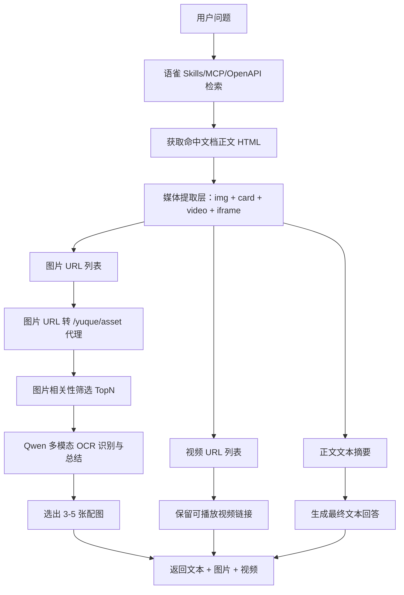

# 语雀媒体增强开发计划（Skills/MCP + Qwen 多模态）

> **适用范围**：当前基于语雀知识库的 AI 销售顾问。
> **当前架构前提**：本期**不引入 RAG 向量化**，继续沿用「语雀 Skills / MCP / OpenAPI + 大模型」主链路。
> **目标**：让系统在回答时可返回图片和视频；图片由 Qwen 多模态执行 OCR 式识别与总结，视频优先返回可播放链接，前端直接可视化展示。

---

## 1. 语雀平台能力基线（调研结论）

以下为本计划所依赖的语雀底层能力，均在动手前完成核实。

### 1.1 语雀 OpenAPI（核心接口）

| 接口 | 用途 | 方法 |
|------|------|------|
| `GET /api/v2/search?q=...&type=doc` | 通用搜索 | GET |
| `GET /api/v2/repos/{id}/docs` | 知识库文档列表（分页，默认 100 条） | GET |
| `GET /api/v2/repos/{id}/docs/{id}` | 获取文档详情（含 body HTML） | GET |
| `GET /api/v2/repos/{id}/toc` | 获取知识库目录 | GET |
| `GET /api/v2/repos/{id}/docs/{id}/versions` | 获取文档历史版本列表 | GET |

- **域名**：`https://www.yuque.com`，访问空间内资源需使用该空间子域名。
- **鉴权**：`X-Auth-Token` Header。
- **限流**：每小时 5000 次，每秒 100 次；返回头含 `X-RateLimit-Limit` / `X-RateLimit-Remaining`。
- **关键约束**：语雀 OpenAPI **不提供独立的「媒体/附件/图片 API」**，所有图片、视频资源均嵌入在文档 `body` 的 HTML 中。

参考来源：
- [语雀 OpenAPI 接口文档](https://www.yuque.com/yuque/developer/openapi)
- [语雀开发者文档导航](https://www.yuque.com/yuque/developer)
- 本地下载的 `yuque_openapi_20251121_green.html`

### 1.2 文档 Body HTML 格式

语雀 `get_doc` 返回的 `body` 是 HTML。新旧两种格式：

- **新格式（2021-04-13 后创建/编辑）**：`<div class="lake-content">` 包裹，含 ``、`<card>`、`<video>`、`<pre>`、`<p>` 等 Lake 编辑器元素。
- **旧格式**：`<div class="lake-engine">` 包裹。
- 图片的 CSS 可引用 `http://editor.yuque.com/ne-editor/lake-content-v1.css` 做样式复原。

参考：[文档 HTML 格式说明](https://www.yuque.com/yuque/developer/yr938f)

### 1.3 图片在 Body 中的两种形态

**形态 A：标准 `` 标签**
```html

```

**形态 B：`<card>` 标签（Lake 编辑器内联卡片）**
```html
<card type="inline" name="image" value="urlsafe_base64_json">
```

解码 `value` 后得到 JSON，核心字段：
- `src`：图片原始 URL
- `name`：图片文件名
- `originalType`：`binary` / `url`
- `status`：`done` / `pending`
- `ratio`：宽高比

**图片 CDN 防盗链**：语雀 CDN（`cdn.nlark.com` 等）对非语雀域名的 `Referer` 请求可能返回 403。已知方案：
1. 后端代理 (`/yuque/asset`) 并注入 `X-Auth-Token` 和合法的 `Referer: https://www.yuque.com/`。
2. 前端通过代理 URL 展示图片，不直接引用 CDN 地址。

**图片白名单 CDN 主机**（语雀官方 + 阿里生态）：
- `yuque.com`、`yuque.net`
- `nlark.com`、`larkusercontent.com`
- `alicdn.com`、`qpic.cn`

参考：
- [图片（image）编辑器配置](https://www.yuque.com/yuque/developer/ndc8rsu3hyqtnext)
- [适配器 envAdapter（含 previewImgs）](https://www.yuque.com/yuque/developer/ggspapip2fvgao1w)

### 1.4 视频在 Body 中的形态

语雀编辑器支持视频上传，在 body 中可能出现：

- `<video>` 标签（含 `<source>` 子元素）
- `<card>` 标签（含视频信息 JSON）
- `<iframe>` 嵌入播放器
- 裸视频 URL（Markdown / 正文中直接引用）

语雀编辑器配置 `video.createUploadPromise` 和 `video.crawlVideo` 可自定义上传/转存逻辑，但**阅读态没有内置视频内容解析能力**。

**关键结论**：语雀 API 并不保证视频可播放链接稳定有效；第一期最稳妥的做法是「抽 URL → 前端尝试播放 → 失败则跳转原链接」。

参考：
- [视频（video）编辑器配置](https://www.yuque.com/yuque/developer/zpgag8tzyngarar1)
- [附件（file）编辑器配置](https://www.yuque.com/yuque/developer/mkkq8a1h7h8nxwvb)

### 1.5 语雀 MCP / Skills / Ecosystem

| 组件 | 说明 |
|------|------|
| `yuque-mcp` | 16 个标准 MCP Tools，含 `yuque_search`、`yuque_get_doc`、`yuque_list_docs`、`yuque_get_toc` |
| Skills | 8 个场景化工作流（智能搜索、智能摘要、过期检测等），覆盖知识管理全生命周期 |
| Plugin | MCP + Skills 的一键集成包 |

**与本计划的关系**：Skills/MCP 负责「检索与取正文」，媒体增强在正文拿到之后发生，两者独立。

参考：[Yuque AI Ecosystem](https://yuque.github.io/yuque-ecosystem/)

---

## 2. 背景与问题定义

当前系统已经具备：

- 基于语雀 `search / get_doc / list_docs / toc` 的知识获取能力。
- 基于 Qwen 多模态的图片识读能力（`doc_image_enrichment.py`、`v4_vision_enrichment.py`）。
- 前端图文/视频基础渲染能力（`App.tsx` 中的 `MediaItem` 卡片）。
- `/yuque/asset` 代理解决图片 CDN 防盗链。
- 从 body 中提取图片链接的能力（`yuque_images.py`）。

但在产品能力上仍有几个明显缺口：

- 当前媒体能力分散在多个模块中，缺少一条稳定、清晰的「媒体优先返回」链路。
- 图片虽然可被视觉模型识读，但还没有固定为「选图 → OCR 式总结 → 返回 3-5 张」的产品策略。
- 视频已有抽取基础，但没有形成「可播放返回」的标准接口约定。
- `<card>` 标签中的图片/视频 JSON 数据尚未被稳定解析。
- 前端已有基础展示，但还缺少稳定的图片画廊和视频播放交互。

---

## 3. 本期北极星

用户提出与产品功能、界面操作、文档讲解相关的问题时，系统能够：

- 先通过语雀 Skills / MCP / OpenAPI 找到相关文档。
- 从文档正文（HTML）中抽取相关图片与视频资源。
- 对图片调用 Qwen 多模态做 OCR 式文字识别与内容总结。
- 返回 3-5 张最相关配图给前端展示。
- 若存在视频，则返回可播放链接或视频卡片，用户可直接点击观看。
- 最终回答由「文本回答 + 图片列表 + 视频列表」组成。

---

## 4. 范围定义

### 4.1 本期要做

1. **完善媒体提取层**：覆盖 ``、`<card name="image">`、`<video>`、`<iframe>` 等标签，并解码 Lake JSON 卡片数据。
2. **建立图片识别链路**：候选图筛选、Qwen OCR 式总结、返回 3-5 张配图。
3. **建立视频返回链路**：优先返回可播放视频链接，不强制做视频语义解析。
4. **统一后端接口的媒体返回结构**，前端按结构化数据渲染。
5. **增加开关、日志、调试信息与基础测试**，支持灰度和回退。
6. **图片防盗链处理**：确保返回前端的图片 URL 走 `/yuque/asset` 代理而非裸 CDN 地址。

### 4.2 本期不做

1. 不引入 FAISS / 向量数据库 / 文档离线 embedding。
2. 不做完整视频内容理解、逐帧分析、字幕抽取或 ASR。
3. 不做专业文档 OCR 引擎替换，仅使用 Qwen 多模态完成 OCR 式识别与总结。
4. 不重构现有语雀 Skills / MCP 协议，只在现有链路上增强媒体能力。
5. 不做语雀附件（docx/pdf/zip 等）的下载/预览——那是独立需求。

---

## 5. 总体方案

### 5.1 方案概览



### 5.2 核心原则

- **不改主检索范式**：继续使用语雀现有 Skills / MCP / API，媒体增强在正文拿到后发生。
- **先统一提取，再分类处理**：HTML body → 媒体提取层 → 图片链路 + 视频链路。
- **所有媒体 URL 走代理**：前端不直接引用语雀 CDN 地址，避免防盗链 403。
- **图片优先于视频理解**：图片 OCR 式识别先落地，视频先返回链接即可。
- **结果结构化**：媒体必须以独立字段返回，不能只拼在文本里。
- **随时可回退**：关闭媒体增强后，行为退化为纯文本回答。

---

## 6. 能力拆解

### 6.1 媒体提取层（基础能力，Phase 0-1 共同依赖）

**目标**：从语雀 `get_doc` 返回的 HTML body 中稳定提取所有图片和视频资源。

**需要处理的格式**：

| 来源格式 | 提取方式 | 当前项目支持情况 |
|----------|----------|-----------------|
| `` | 正则匹配 `src` + `data-src` | 已支持（`yuque_images.py`） |
| Markdown `` | 正则匹配 | 已支持 |
| `<card name="image" value="base64json">` | base64 解码 JSON，取 `src` | **需新增** |
| `<video><source src="..."></video>` | 正则匹配 | 已部分支持 |
| `<iframe src="...">` | 正则匹配 | 已部分支持 |
| 裸视频 URL（Markdown/正文） | 正则 + 扩展名匹配 | 已部分支持 |

**新增解析逻辑**：

- `<card>` 标签的 `value` 属性为 URL-safe Base64 编码的 JSON；解码后以 `src` 字段为图片/视频 URL。
- 图片卡片常见 JSON 字段：`src`、`name`、`originalType`、`status`（`done` 才可用）、`ratio`。
- 视频卡片常见 JSON 字段：`src`、`name`、`status`。

### 6.2 图片能力

**目标**：从命中文档中选出与问题最相关的 3-5 张图片，给出每张图的 OCR 式总结。

**策略**：

1. 从命中文档正文中提取全部图片引用（含 `` 和 `<card>` 两种格式）。
2. 所有图片 URL 转为 `/yuque/asset?t=base64(原始URL)` 代理地址，解决防盗链。
3. 根据用户问题与图片上下文（文档标题、alt 文本、文件名）做相关性筛选，取前 N 张候选。
4. 对每张候选图下载原始数据，调用 Qwen 多模态做 OCR 式识别。
5. 统一 prompt：
   - 提取图中可见文字要点。
   - 概括截图中的步骤、入口、模块、界面含义。
   - 避免编造图中不存在的信息。
   - 不超过 280 字。
6. 按相关性 + OCR 质量得分选出最终 3-5 张返回。

**输出字段**：

- `url`：代理后的图片地址（`/yuque/asset?t=...`）
- `title`：图片标题/alt
- `doc_title`：所属文档标题
- `summary`：Qwen 识别的图文摘要
- `score`：相关性得分

### 6.3 视频能力

**目标**：把文档中的视频作为可消费的结果返回给前端。

**策略**：

1. 从命中文档正文中提取视频 URL（含 `<video>`、`<iframe>`、`<card>`、裸链接）。
2. 判断链接类型：语雀 CDN 直链 / 第三方嵌入 / 页面链接。
3. 语雀 CDN 直链优先代理后以 `<video>` 方式在前端播放。
4. 第三方/不确定链接以「打开原视频」跳转形式返回。
5. 第一期不做视频语义解析，仅预留 `summary` 字段。

**输出字段**：

- `url`：视频地址
- `title`：视频标题
- `doc_title`：所属文档标题
- `summary`：可选，第一期为空

### 6.4 文本回答与媒体协同

文本主回答仍保留，但需要与媒体结果协同：

- 返回图片时，文本中应提示「可参考下方配图」。
- 返回视频时，文本中应提示「可点击下方视频查看演示」。
- 图片 OCR 失败不影响主回答生成。
- 视频链接不可播放时前端仍展示跳转入口。

---

## 7. 阶段实施计划

### Phase 0：方案固化与接口定义（0.5 天）

**目标**：不大改现有主流程，先把媒体链路需要的开关、结构和约定定下来。

**交付项**：

1. 明确统一响应结构：
   - `answer`：文本回答
   - `images[]`：图片列表（`url`、`title`、`doc_title`、`summary`、`score`）
   - `videos[]`：视频列表（`url`、`title`、`doc_title`、`summary`）
   - `debug.media_trace`：媒体处理追踪
2. 定义媒体开关：
   - `MEDIA_ENABLED`：总开关
   - `MEDIA_IMAGE_ENABLED`：图片子开关
   - `MEDIA_VIDEO_ENABLED`：视频子开关
   - `MEDIA_MAX_IMAGES`：最大图片返回数（默认 5）
   - `MEDIA_MAX_VIDEOS`：最大视频返回数（默认 2）
3. 补全 `<card>` 标签解析逻辑的接口约定。
4. 定义图片总结 prompt 规范与 token 预算。
5. 定义视频回退策略与前端展示约定。

**验收**：
- 开关关闭时，系统行为与当前基本一致。
- 接口结构确定后，前后端可并行开发。

---

### Phase 1：媒体提取层完善 + 图片返回 + Qwen OCR 总结（2-3 天）

**目标**：先把图片链路跑通，拿到最直接的产品增益。

**交付项**：

1. **扩展 `yuque_images.py`**：
   - 增加 `<card name="image" value="base64json">` 标签的 JSON 解码与 `src` 提取。
   - 增加 `status=done` 过滤，排除上传中/失败的图片。
2. **统一媒体提取入口**：
   - 在 `app/service/` 下新增或收口 `media_extractor.py`，统一处理 img + card + video + iframe 提取。
3. **图片 URL 代理**：
   - 所有提取出的图片 URL 统一编码为 `/yuque/asset?t=...`。
   - 已有 `encode_image_proxy_token()` 可直接复用。
4. **图片筛选**：
   - 按文档标题/图片 alt/文件名与问题的关键字匹配度排序。
   - 限制候选图数量为配置的 `MEDIA_MAX_IMAGES + buffer`。
5. **Qwen OCR 式识别**：
   - 复用现有 `_vision_caption()` 的下载+识图流程。
   - 统一 prompt：「列出图中可见文字要点，概括步骤/界面含义，不超过 280 字，不编造」。
6. **前端渲染图片卡片**：
   - assistant 消息下方展示 3-5 张图片卡片。
   - 每张卡片含缩略图、标题、来源文档、OCR 总结文字。
   - 点击可查看大图。

**验收**：
- 用户问某个功能操作时，回答下方可出现相关截图及说明。
- 图片说明能概括图中关键文字或步骤。
- 图片识别失败时，文本回答仍可正常返回。
- `<card>` 格式图片也能被正确提取和展示。

---

### Phase 2：视频链接返回与前端播放（1-2 天）

**目标**：让系统能把文档中的视频作为可消费的结果返回。

**交付项**：

1. **完善视频提取**：
   - 增加 `<card name="video">`、`<card name="attachment">` 中的视频 URL 解析。
   - 补充语雀视频 CDN / 嵌入类型的识别。
2. **视频链接可播放性判断**：
   - 语雀 CDN 直链（可通过代理直接播放）→ 以 `<video>` 方式展示。
   - 第三方/嵌入/不确定链接 → 以「打开原视频」跳转方式展示。
3. **视频 URL 代理**：
   - 语雀 CDN 视频同样走 `/yuque/asset` 代理。
4. **前端视频卡片**：
   - 优先原生 `<video>` 播放器。
   - 若不能直接播放，显示「打开原视频」按钮并展示来源文档。
   - 视频封面图可使用默认占位或从视频中截取。

**验收**：
- 命中文档含视频时，前端能看到视频卡片。
- 用户可以直接点击播放或跳转原链接。
- 视频链路失败不影响文本和图片返回。

---

### Phase 3：媒体与文本协同 + 调试信息（1 天）

**目标**：让「文本 + 图片 + 视频」组合体验更自然。

**交付项**：

1. 主回答 prompt 中注入媒体返回提示（图片数量、视频数量）。
2. 给图片和视频补充来源文档信息（标题、doc_id）。
3. 按问题类型控制媒体返回优先级：
   - 问「怎么操作」→ 优先图片
   - 问「有没有演示」→ 优先视频
   - 纯事实问答 → 不强制返回媒体
4. 增加媒体调试信息与日志：
   - 提取的图片/视频总数
   - 最终使用的图片/视频数量
   - 视觉模型调用次数与耗时
   - 解析失败的媒体数量及原因

**验收**：
- 文本、图片、视频的关联关系清晰。
- 开发者面板或 debug JSON 中可看到媒体处理详情。

---

### Phase 4：灰度上线与体验打磨（0.5-1 天）

**目标**：控制风险，逐步上线。

**交付项**：

1. 环境变量开关控制灰度（`MEDIA_ENABLED` + 子开关）。
2. 增加超时、失败回退：
   - 视觉模型调用超时（如 15s）→ 跳过该图片
   - 图片下载失败 → 降级为无 media
3. 完善前端体验：
   - 图片加载失败时的占位提示
   - 视频播放失败的降级展示
   - 媒体为空的空态处理
4. 建立上线检查清单。

**验收**：
- 可以按开关控制该能力。
- 关闭媒体增强后快速恢复为纯文本模式。
- 灰度期间无阻断错误。

---

## 8. 后端改造建议

### 8.1 推荐改造策略

- **最小改造路线**：在现有模块上收口，不新建大量文件。
- 当前已有组件充分复用到的地方：
  - `app/data/yuque_images.py`：扩展 `<card>` 解析
  - `app/rag/doc_image_enrichment.py`：复用 `_download_image`、`_vision_caption`
  - `app/api/chat_api.py`：复用 `/yuque/asset` 代理
  - `app/schemas/chat.py`：扩展 `ChatMediaBundle` / `MediaItem`
- 需要新增的核心逻辑：
  - 媒体提取收口（统一处理 img/card/video/iframe）
  - 图片筛选与 TopN 排序
  - 媒体响应构造器

### 8.2 建议新增/调整的模块

| 模块 | 职责 | 优先级 |
|------|------|--------|
| `app/data/yuque_images.py`（改） | 增加 `<card>` JSON 解码与解析 | P0 |
| `app/service/media_extractor.py`（新增） | 统一媒体提取入口（img + card + video + iframe） | P0 |
| `app/service/media_selector.py`（新增） | 按问题与文档相关性筛选候选媒体 | P1 |
| `app/service/media_response_builder.py`（新增） | 统一构造 `images[]` 和 `videos[]`，注入代理 URL | P1 |
| `app/schemas/chat.py`（改） | 扩展 `MediaItem` 字段：`summary`、`score`、`proxy_url` | P0 |

### 8.3 接口结构

```json
{
  "answer": "教师端账号开通需要在左侧菜单进入「账户管理」，点击右上角「新增账号」按钮...",
  "images": [
    {
      "url": "/yuque/asset?t=xxx",
      "title": "账户配置页面",
      "doc_title": "教师端账号开通说明",
      "summary": "图片展示账号开通入口位于左侧菜单「账户管理」，点击后可见右上角蓝底白字「新增账号」按钮。下方表格展示了角色选择下拉框和保存按钮位置。",
      "score": 0.91
    }
  ],
  "videos": [
    {
      "url": "https://cdn.nlark.com/yuque/0/2024/video/xxx.mp4",
      "title": "教师端操作演示",
      "doc_title": "教师端使用指南",
      "summary": ""
    }
  ],
  "debug": {
    "media_trace": {
      "extract": {
        "images_total": 8,
        "videos_total": 1,
        "cards_parsed": 5,
        "cards_with_src": 4,
        "parse_errors": 0
      },
      "images_used": 4,
      "videos_used": 1,
      "vision_model": "qwen3.6-flash",
      "vision_calls": 5,
      "vision_ok": 4,
      "vision_failed": 1,
      "vision_elapsed_ms": 3200
    }
  }
}
```

---

## 9. 前端改造建议

### 9.1 图片展示

前端消息卡片中增加图片区域：

- 支持最多显示 3-5 张图片。
- 每张图展示缩略图、标题、来源文档、OCR 简要说明。
- 点击可大图预览或轮播。
- 图片加载失败时给出灰色占位图 + 重试入口。

### 9.2 视频展示

前端消息卡片中增加视频区域：

- 优先原生 `<video>` 播放器（带 controls、poster 占位）。
- 若不能直接播放，显示「打开原视频」按钮。
- 展示来源文档名称，便于用户理解上下文。

### 9.3 交互细节

- 媒体为空时不展示媒体区块（组件不渲染，不占空间）。
- 图片和视频加载失败时给出占位提示而非空白。
- 文本回答与媒体列表应在一个 assistant 消息下展示，避免割裂。
- SSE 阶段可显示 `vision` 进度标识（当前已有基础）。

---

## 10. 配置建议

```bash
# 媒体增强总开关
MEDIA_ENABLED=true
MEDIA_IMAGE_ENABLED=true
MEDIA_VIDEO_ENABLED=true
MEDIA_MAX_IMAGES=5
MEDIA_MAX_VIDEOS=2

# 视觉识别（复用现有配置）
VISION_ENABLED=true
VISION_MODEL=qwen3.6-flash
VISION_BASE_URL=https://dashscope.aliyuncs.com/compatible-mode/v1
VISION_API_KEY=sk-xxx
VISION_MAX_IMAGES=5
VISION_MAX_BYTES=4000000

# 图片代理（复用现有配置，默认已开启）
DOC_IMAGES_MARKDOWN_IN_CONTEXT=true
DOC_IMAGES_FULL_DOCUMENT_FALLBACK=false

# DashScope（视觉模型共用）
DASHSCOPE_API_KEY=sk-xxx
DASHSCOPE_BASE_URL=https://dashscope.aliyuncs.com/compatible-mode/v1
```

**模型选择建议**：
- 首选用 `qwen3.6-flash` 验证效果（速度快、成本低）。
- 如果复杂截图识别不稳，再升级到 `qwen3.6-plus`。

---

## 11. 风险与应对

| 风险 | 影响 | 应对 |
|------|------|------|
| 语雀 CDN 图片防盗链 403 | 图片无法在前端展示 | 后端 `/yuque/asset` 代理 + `Referer` 头 + `X-Auth-Token` |
| `<card>` JSON 解码格式不统一 | 部分图片无法提取 | 容错解析 + 日志记录解析失败的卡片数量 |
| Qwen 多模态图片识别不稳定 | OCR 总结质量差 | 统一 prompt、限制长度、识别失败时不阻塞主回答 |
| 视频链接不可直接播放 | 用户体验差 | 提供「打开原视频」跳转入口作为兜底 |
| 媒体过多导致响应变慢 | 用户等待时间长 | 限制数量（图片 3-5、视频 1-2）、视觉调用超时 15s |
| 视觉模型成本过高 | 费用超出预期 | 限制 `VISION_MAX_IMAGES`、可关闭 `VISION_ENABLED` 仅返回 Markdown 图片链接 |
| 语雀文档媒体格式持续变化 | 提取逻辑过时 | 提取层独立模块、日志追踪解析成功率、定期回归测试 |

---

## 12. 测试计划

### 12.1 单元测试

- `` 标签图片 URL 提取
- `<card name="image">` JSON 解码与 src 提取
- `<video>` / `<source>` / `<iframe>` 视频 URL 提取
- Markdown 图片/视频语法提取
- 白名单域名校验（`is_allowed_yuque_image_url`）
- 图片筛选 TopN 排序
- 媒体响应结构构造
- 开关关闭时的降级行为

### 12.2 集成测试

- 命中含图片文档时，接口返回 `images[]`
- 命中含 `<card>` 图片文档时，接口也能返回 `images[]`
- 命中含视频文档时，接口返回 `videos[]`
- 视觉模型调用失败时，接口仍可正常返回文本回答
- 视频播放链接不可达时，前端仍可展示跳转入口
- 代理 URL (`/yuque/asset`) 正常转发图片

### 12.3 手工验收

- 问「这个功能怎么配置」→ 返回 3-5 张步骤图，每张有文字说明
- 问「有没有演示视频」→ 返回视频卡片或视频链接
- 问纯文本类问题 → 不出现无关媒体
- 关闭 `MEDIA_ENABLED` → 仅返回文本回答

---

## 13. 执行优先级建议

| 优先级 | 阶段 | 理由 |
|--------|------|------|
| 1 | Phase 1 图片链路 | 最快形成可见价值，用户感知最强 |
| 2 | Phase 2 视频返回 | 补齐播放体验，改动量可控 |
| 3 | Phase 3 协同 + 日志 | 提升可用性与可观测性 |
| 4 | Phase 4 灰度 + 打磨 | 控制风险，逐步上线 |

---

## 14. 预估工期

| 阶段 | 工期 | 说明 |
|------|------|------|
| Phase 0 | 0.5 天 | 接口定义与开关 |
| Phase 1 | 2-3 天 | `<card>` 解析 + 图片筛选 + OCR 识别 + 前端渲染 |
| Phase 2 | 1-2 天 | 视频提取 + 前端播放 |
| Phase 3 | 1 天 | 协同逻辑 + 调试信息 |
| Phase 4 | 0.5-1 天 | 灰度开关 + 体验打磨 |

总计：约 **5-7 个工作日**（单人开发节奏）。

---

## 15. 里程碑验收口径

达到以下标准即可视为本期完成：

- 用户提问后，系统可返回文本 + 图片 + 视频结构化结果。
- `<card>` 和 `` 两种格式的图片均能正确提取。
- 图片返回数量控制在 3-5 张，每张有 OCR 式总结。
- 所有图片 URL 均走 `/yuque/asset` 代理，前端无 403。
- 视频可在前端直接播放或点击跳转观看。
- 关闭 `MEDIA_ENABLED` 后，系统退回纯文本模式。
- 前后端均有基础日志与测试，便于后续扩展。

---

## 16. 参考资料

| 资料 | 内容 |
|------|------|
| [语雀 OpenAPI 接口文档](https://www.yuque.com/yuque/developer/openapi) | API 接口列表、字段说明、OAS 文件下载 |
| [文档 HTML 格式说明](https://www.yuque.com/yuque/developer/yr938f) | body HTML 格式、lake-content/lake-engine 区别 |
| [图片编辑器配置](https://www.yuque.com/yuque/developer/ndc8rsu3hyqtnext) | 图片上传/转存接口约定、crawlURL/uploadFileURL |
| [视频编辑器配置](https://www.yuque.com/yuque/developer/zpgag8tzyngarar1) | 视频上传/createUploadPromise/crawlVideo |
| [附件编辑器配置](https://www.yuque.com/yuque/developer/mkkq8a1h7h8nxwvb) | getFileDownloadURL/getPreviewUrl |
| [适配器 envAdapter](https://www.yuque.com/yuque/developer/ggspapip2fvgao1w) | previewImgs 图片预览、openLink 链接打开 |
| [Yuque AI Ecosystem](https://yuque.github.io/yuque-ecosystem/) | MCP Server / Skills / Plugin |
| [DashScope API 参考](https://help.aliyun.com/zh/model-studio/qwen-api-via-dashscope) | Qwen 多模态调用方式 |

---

## 17. 变更记录

| 日期 | 变更说明 |
|------|----------|
| 2026-06-01 | 初版：聚焦「语雀 Skills/MCP + Qwen 多模态」的媒体增强开发计划 |
| 2026-06-02 | **完善版**：补全语雀 API/开发者文档调研结论（HTML 格式、`<card>` 解析、CDN 防盗链、限流）、细化阶段交付项、增加 `<card>` JSON 解码需求、补充媒体提取层设计、扩展风险与测试计划 |
